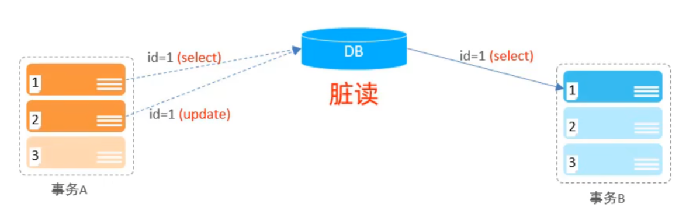
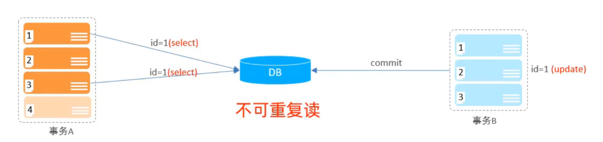
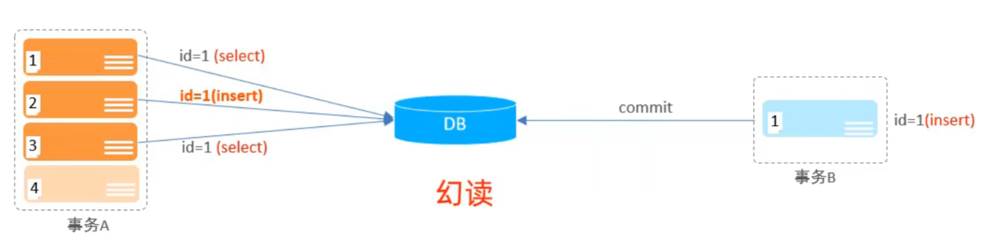
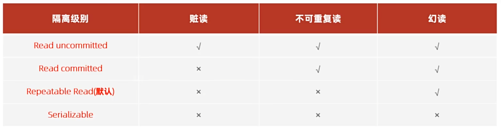

# MySQL数据库

## 一、多表关系

### 1.一对多
可以在创建表是或者表结构创建完成后，为字段添加外键约束
e.g.部门与员工之间的关系为一对多，一个部门下有多个员工，外键约束是员工的id，由此建立部门表和员工表的关系。

具体语法如下：

```sql
-- 创建表时指定
create table dept{
    ...
    [constraint][外键名称] foreign key (外键字段名)references 主表（字段名）
}
```

```sql
-- 建完表后添加外键
alter table 表名 add constraint 外键名称 foreign key （外键字段名） references 主表（字段名）
```

**注意：外键名称为"fk_表1_表2_关联的变量名"**

### 2.多对多
需要建立一张中间表，中间表有两个外键字段，分别关联两方的主键
* e.g.学生与课程之间的关系
* 关系：一个学生有多个课程，每个课程有多个学生选择
* **实现：建立第三章中间表，中间表至少包含两个外键，分别关联两方主键**

### 3.一对一
一对一是特殊的一对多（方法与一对多同理）。在任意一方添加外键，关联另一方的主键
* e.g.用户与身份证信息的关系
* 关系：一对一关系，用于单表拆分，将一张表的基础字段放在一张表上，其他字段放在另一张表上，**以提升操作效率**。
* **实现：在任意一方加入外键，关联另一方的主键，并且设置外键为唯一的（unique）**


## 二、多表查询
### 1.内连接
内连接指的是两张表交集部分的数据
```sql
-- 内连接
-- 1.查询所有员工的ID，姓名，及其所属的部门名称（隐式、显式内连接）
-- 隐式
select emp.id,emp.name,dept.name from emp,dept where emp.dept_id = dept.id;

-- 显式
select emp.id,emp.name,dept.name from emp inner join dept on emp.dept_id = dept.id;

select emp.id,emp.name,dept.name from emp join dept on emp.dept_id = dept.id;

-- 2.查询性别为男，且工资高于8000的员工的ID，姓名，及其所属的部门名称（隐式、显式内连接）
-- 隐式
select emp.id,emp.name,dept.name from emp,dept where emp.dept_id = dept.id and gender=1 and emp.salary>8000;

-- 显式
select emp.id,emp.name,dept.name from emp inner join dept on emp.dept_id = dept.id where gender=1 and emp.salary>8000;

-- 为表起别名
select e.id,e.name,d.name from emp e join dept d on e.dept_id = d.id where gender=1 and e.salary>8000;
```

### 2.外连接
左外连接和右外连接

```sql
-- 外连接
-- 1.查询员工表所有员工的姓名，和对应的部门名称（左外连接）
select e.name,d.name from emp e left outer join dept d on e.dept_id=d.id;

-- 2.查询部门表所有部门的名称，和对应的部门名称（右外连接）
select d.name,e.name from emp e right outer join dept d on e.dept_id = d.id;

-- 3.查询工资高于8000的所有员工的姓名和对应部门名称
select e.name,d.name from emp e left join dept d on e.dept_id = d.id where e.salary>8000;
```

## 三、动态sql
动态 SQL 是 MyBatis 提供的核心功能，能根据不同的条件动态拼接 SQL 语句，避免手动拼接 SQL 带来的语法错误和安全问题

`<if>`单条件判断，满足则拼接 SQL	条件查询、动态更新
`<where>`	自动处理前缀 and、or，无条件时不生成 where 子句	多条件查询
`<set>`自动处理后缀逗号，无更新字段时不生成 set 子句	动态更新
`<foreach>`	遍历集合（List / 数组），拼接批量操作 SQL	批量删除、批量插入
`<choose>`	多条件分支（类似 Java 的 switch），只执行一个满足的条件	多条件互斥查询


## 四、事务、ACID
### 1.事务四大特性

- 原子性（Atomicity）：事务是不可分割的最小操作单元，要么全部成功，要么全部失败。
- 一致性（Consistency）：事务完成时，必须使所有的数据都保持一致状态。
- 隔离性（Isolation）：数据库系统提供的隔离机制，保证事务在不受外部并发操作影响的独立环境下运行。
- 持久性（Durability）：事务一旦提交或回滚，它对数据库中的数据的改变就是永久的。
### 2.并发事务问题
|问题	|描述|
|-|-|
|脏读|	一个事务读到另外一个事务还没有提交的数据。|
|不可重复读|	一个事务先后读取同一条记录，但两次读取的数据不同，称之为不可重复读。|
|幻读|	一个事务按照条件查询数据时，没有对应的数据行，但是在插入数据时，又发现这行数据已经存在，好像出现了 “幻影”。|

1)脏读

2)不可重复读

3)幻读


### 3.事务隔离级别


```sql
-- 查看事务隔离级别
SELECT @@TRANSACTION_ISOLATION;

-- 设置事务隔离级别
SET [SESSION|GLOBAL] TRANSACTION ISOLATION LEVEL {READ UNCOMMITTED | READ COMMITTED | REPEATABLE READ | SERIALIZABLE};
```

### 4.事务操作
1)查看/设置事务提交方式
```sql
SELECT @@autocommit;
SET @@autocommit = 0;
```

2)提交事务
```sql
COMMIT;
```

3)回滚事务
```sql
ROLLBACK;
```


---

## 五、锁（Lock）

锁是计算机协调多个进程或线程并发访问某一资源的机制，主要用于解决事务并发访问时的数据一致性问题。

### 1.锁的分类

**（1）按锁粒度划分**

| 锁类型 | 描述        |
| --- | --------- |
| 全局锁 | 锁定整个数据库实例 |
| 表级锁 | 锁定整张表     |
| 行级锁 | 锁定某一行记录   |

**（2）按操作类型划分**

| 锁类型     | 描述                |
| ------- | ----------------- |
| 共享锁（S锁） | 允许读，不允许写          |
| 排他锁（X锁） | 允许当前事务读写，其他事务不能读写 |

### 2.全局锁

对整个数据库实例加锁。

```sql
-- 加全局锁
flush tables with read lock;

-- 解锁
unlock tables;
```

**应用场景**：数据库全库备份（`mysqldump`）

加锁期间：
* 可以查询
* 不可以增删改

### 3.表级锁

**（1）表锁**

```sql
-- 加读锁
lock tables 表名 read;

-- 加写锁
lock tables 表名 write;

-- 解锁
unlock tables;
```

读锁特点：
* 当前客户端：可以查询，不可以更新
* 其他客户端：可以查询，不可以更新

写锁特点：
* 当前客户端：可以查询，可以更新
* 其他客户端：不可以查询，不可以更新

**（2）元数据锁（MDL）**

Meta Data Lock，对表进行 CRUD 操作时自动加 MDL 锁，避免 DDL 和 DML 冲突。

例如：执行 `select * from emp;` 时，`alter table emp add age int;` 会被阻塞。

**（3）意向锁**

为了提高表锁与行锁共存时的效率。
* **意向共享锁（IS）**：表示事务准备给某些数据行加共享锁
* **意向排他锁（IX）**：表示事务准备给某些数据行加排他锁

### 4.行级锁（InnoDB）

InnoDB 存储引擎支持行锁，特点：锁粒度小、并发度高、加锁开销较大。

**（1）共享锁（S）**

```sql
select * from emp where id = 1 lock in share mode;
-- MySQL8：
select * from emp where id = 1 for share;
```

**（2）排他锁（X）**

```sql
select * from emp where id = 1 for update;
```
其他事务不能修改该记录。

**（3）记录锁（Record Lock）**

锁定单条记录。

```sql
select * from emp where id = 1 for update;
```

**（4）间隙锁（Gap Lock）**

锁定索引记录之间的间隙，防止幻读。

例如：id 为 1, 5, 10，事务A执行：
```sql
select * from emp where id between 1 and 10 for update;
```
会锁住 `(1,5)` 和 `(5,10)` 之间的间隙。

**（5）临键锁（Next-Key Lock）**

记录锁 + 间隙锁，MySQL 默认采用，解决幻读问题。

### 5.死锁

多个事务互相等待对方释放资源。例如：事务A锁住记录1等待记录2，事务B锁住记录2等待记录1，形成死锁。

```sql
-- 查看死锁
show engine innodb status;
```

**死锁解决**：MySQL 自动检测死锁，回滚代价较小的事务并释放锁资源。

## 六、索引（Index）

索引是帮助 MySQL 高效获取数据的数据结构，本质上是**排好序的数据结构**。类似新华字典目录、图书目录，通过索引可以快速定位数据。

### 1.索引的优缺点

**优点**
* 提高查询效率
* 降低磁盘 IO
* 提高排序和分组效率

**缺点**
* 占用存储空间
* 降低增删改效率
* 索引维护需要成本

### 2.索引结构

MySQL 常见索引结构：

| 索引结构     | 描述         |
| -------- | ---------- |
| B+Tree   | MySQL 默认索引 |
| Hash     | 精确匹配       |
| FullText | 全文索引       |
| R-Tree   | 空间索引       |

**B+Tree结构特点**

* 非叶子节点只存索引
* 叶子节点存数据
* 叶子节点形成双向链表
* 查询效率稳定

### 3.索引分类

**（1）主键索引**

```sql
create table user(
    id bigint primary key
);
```

特点：唯一、非空

**（2）唯一索引**

```sql
create unique index idx_email on user(email);
```

特点：唯一、可以为 NULL

**（3）普通索引**

```sql
create index idx_name on user(name);
```

**（4）联合索引**

联合索引是指在多个列上同时建立的一个索引，而不是在每一列上单独建索引。

- 联合索引的本质：排序顺序
联合索引的底层仍然是 B+ 树，但它是按照列的顺序依次排序的：

- 先按 name 排序 → name 相同再按 age 排序
可以想象成字典：先按姓氏排，姓氏相同再按名字排。

```sql
create index idx_name_age on user(name,age);
```

遵循**最左前缀法则**

>联合索引是"一个索引、多列有序"，查询时必须从定义的最左边列开始匹配，才能生效。 设计时要把区分度高、作为等值查询条件的列放在前面。

**（5）全文索引**

```sql
create fulltext index idx_content on article(content);
```

### 4.索引操作

```sql
-- 查看索引
show index from 表名;

-- 创建索引
create index 索引名 on 表名(字段名);

-- 删除索引
drop index 索引名 on 表名;

-- 创建联合索引
create index idx_name_age_gender on emp(name,age,gender);
```

### 5.最左前缀法则

联合索引 `(name, age, gender)` 的生效情况：

**✅ 生效**
```sql
where name='Tom'
where name='Tom' and age=18
where name='Tom' and age=18 and gender=1
```

**⚠ 部分生效**（只使用 `name`）
```sql
where name='Tom' and gender=1
```

**❌ 不生效**（跳过了最左列）
```sql
where age=18
where gender=1
```

### 6.索引失效场景

| 场景 | 示例 |
|------|------|
| 对索引列进行运算 | `where substring(name,1,2)='张三'` |
| 类型隐式转换 | `name` 为 varchar，但 `where name = 123` |
| 模糊查询左侧使用% | `where name like '%三'` |
| OR连接非索引列 | `where id=1 or age=20`（age无索引） |
| 联合索引违反最左前缀 | `(age,gender)` 中 `where gender=1` |

### 7.覆盖索引

查询的数据全部来自索引，无需回表查询，效率最高。

```sql
create index idx_name_age on emp(name,age);

select name,age from emp where name='Tom';
```

### 8.EXPLAIN执行计划

用于分析 SQL 执行情况。

```sql
EXPLAIN SELECT * FROM emp WHERE id = 1;
```

重点关注字段：

| 字段            | 说明     |
| ------------- | ------ |
| id            | 查询顺序   |
| select_type   | 查询类型   |
| table         | 查询表    |
| type          | 访问类型   |
| possible_keys | 可使用索引  |
| key           | 实际使用索引 |
| rows          | 扫描行数   |
| Extra         | 额外信息   |

**type性能排序**（从上到下性能逐渐降低）

```text
NULL > system > const > eq_ref > ref > range > index > ALL
```

重点：尽量达到 `const`、`eq_ref`、`ref`、`range`，避免 `ALL`（全表扫描）。

### 9.索引设计原则

**适合建立索引**
* 主键字段
* 唯一性高的字段
* 经常作为查询条件的字段
* 经常排序、分组的字段
* 多表关联字段

**不适合建立索引**
* 数据量很小的表
* 频繁更新的字段
* 区分度很低的字段（如性别）
* 大字段（TEXT、BLOB）

## 七、MySQL优化总结（面试高频）

### SQL优化

* 避免 `select *`
* 使用覆盖索引
* 避免索引失效
* 小表驱动大表
* 尽量使用联合索引

### 索引优化

* 建立高区分度索引
* 遵循最左前缀法则
* 控制索引数量
* 优先使用联合索引代替多个单列索引

### 事务优化

* 事务尽量短
* 避免长事务
* 及时提交事务
* 合理选择隔离级别

### 锁优化

* 尽量使用行锁
* 缩小锁范围
* 避免死锁
* 建立索引防止行锁升级导致大量扫描