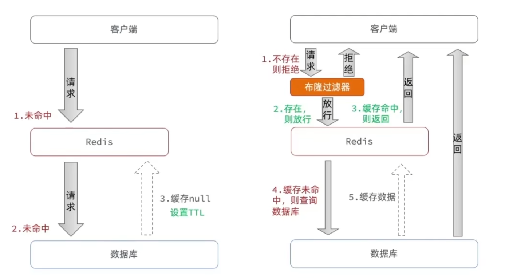
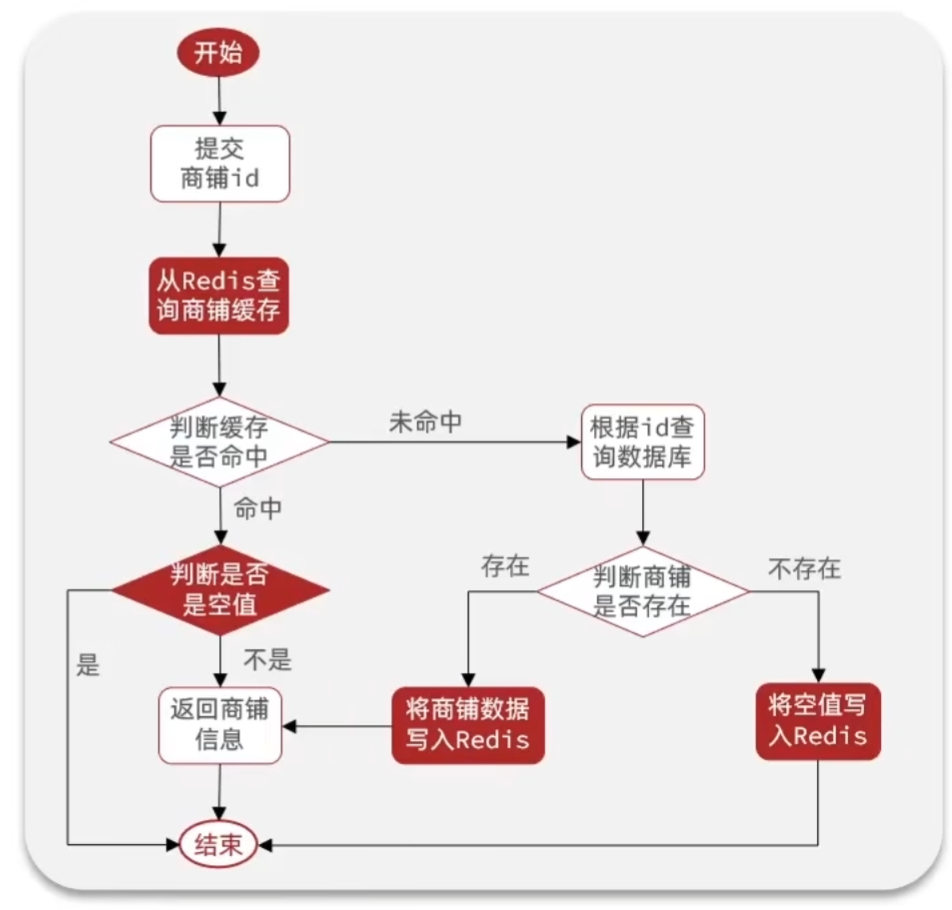
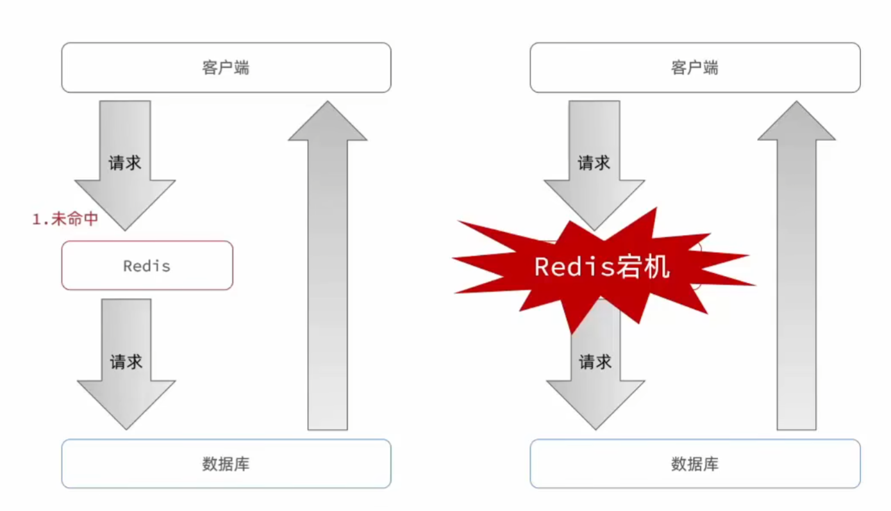
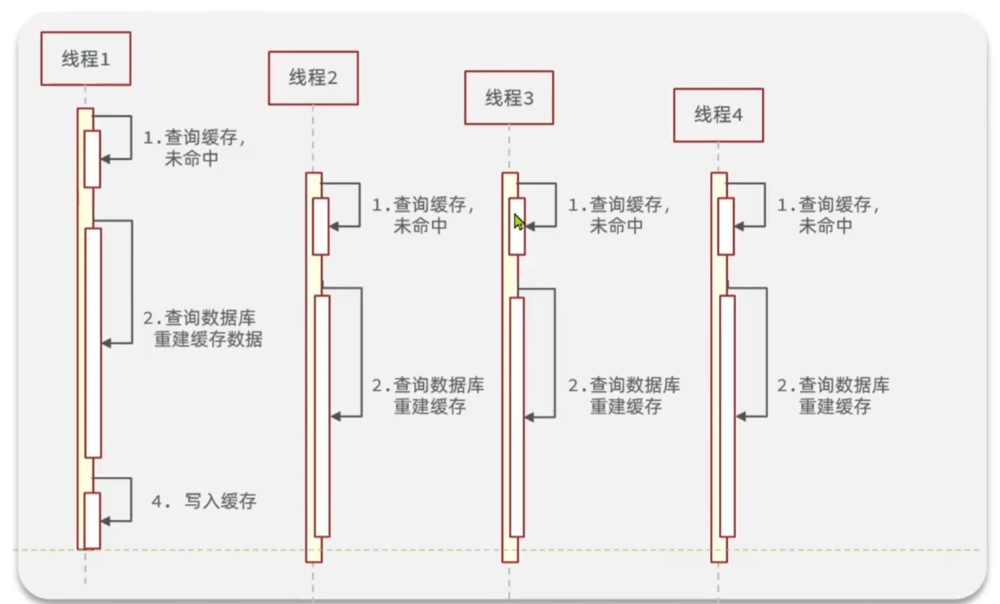
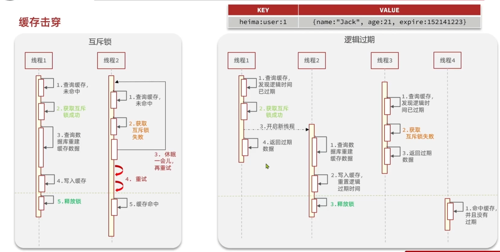
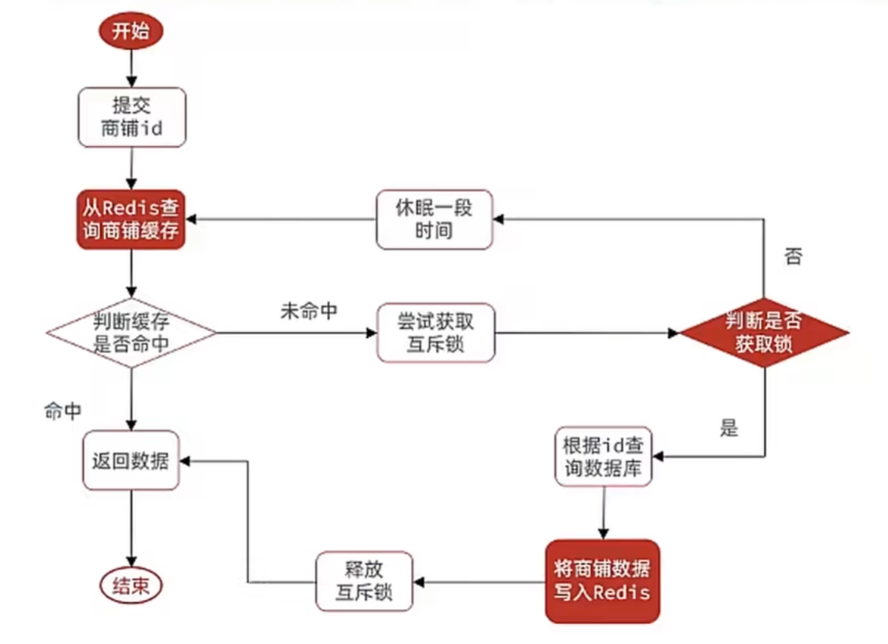
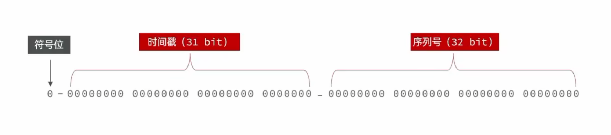
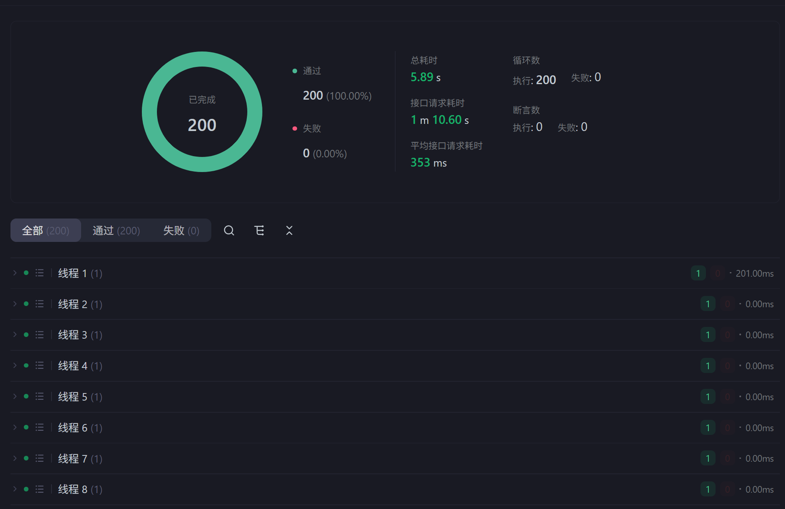
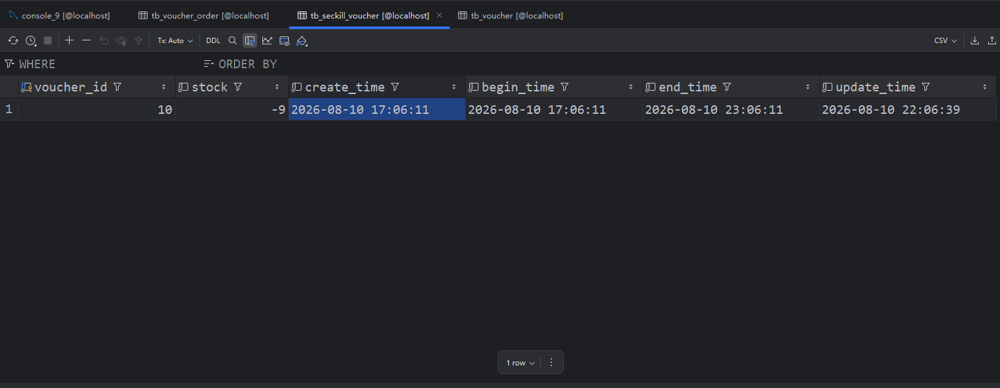

# Redis指南

## 一、Redis简介
基于内存的key-value结构数据库
- 基于内存存储，读写性能高
- 适合存储热点数据（热点商品、咨询、新闻）
- 企业应用广泛

## 二、5种常用数据类型
### 1.数据类型
Redis存储的是key-value结构的数据，其中key是字符串类型，value有五种常用的数据类型：
- 字符串 `string`
- 哈希 `hash`
- 列表 `list`
- 集合 `set`
- 有序集合 `sorted set/zset`
### 2.数据类型的特点
- 字符串 (`string`)：普通字符串，Redis 中最简单的数据类型
- 哈希 (`hash`)：也叫散列，类似于 Java 中的 HashMap 结构
- 列表 (`list`)：按照插入顺序排序，可以有重复元素，类似于 Java 中的 `LinkedList`
- 集合 (`set`)：无序集合，没有重复元素，类似于 Java 中的 HashSet
- 有序集合 (`sorted set /zset`)：集合中每个元素关联一个分数（score），根据分数升序排序，没有重复元素


## 三、Redis常用命令
### 1.字符串
- `SET key value` 设置指定 key 的值
- `GET key` 获取指定 key 的值
- `SETEX key seconds value` 设置指定 key 的值，并将 key 的过期时间设为 seconds 秒
- `SETNX key value` 只有在 key 不存在时设置 key 的值

### 2.哈希
- `HSET key field value` 将哈希表 key 中的字段 field 的值设为 value
- `HGET key field` 获取存储在哈希表中指定字段的值
- `HDEL key field` 删除存储在哈希表中的指定字段
- `HKEYS key` 获取哈希表中所有字段
- `HVALS key` 获取哈希表中所有值

### 3.列表
- `LPUSH key value1 （value2 ...）` 将一个或多个值插入到列表头部
- `LRANGE key start stop` 获取列表指定范围内的元素
- `RPOP key` 移除并获取列表最后一个元素
- `LLEN key` 获取列表长度

### 4.集合
- `SADD key member1 （member2）` 向集合添加一个或多个成员
- `SMEMBERS key` 返回集合中的所有成员
- `SCARD key` 获取集合的成员数
- `SINTER key1 （key2）` 返回给定所有集合的交集
- `SUNION key1 （key2）` 返回所有给定集合的并集
- `SREM key member1 （member2）` 删除集合中一个或多个成员

### 5.有序集合
- `ZADD key score1 member1 （score2 member2）` 向有序集合添加一个或多个成员
- `ZRANGE key start stop （WITHSCORES）` 通过索引区间返回有序集合中指定区间内的成员
- `ZINCRBY key increment member` 有序集合中对指定成员的分数加上增量 increment
- `ZREM key member （member ...）` 移除有序集合中的一个或多个成员

## 四、Spring Data Redis
```java
@SpringBootTest
public class SpringDataRedisTest {

    @Autowired
    private RedisTemplate redisTemplate;

    @Test
    public void testRedisTemplate(){
        System.out.println(redisTemplate);
        ValueOperations valueOperations = redisTemplate.opsForValue();
        HashOperations hashOperations = redisTemplate.opsForHash();
        ListOperations listOperations = redisTemplate.opsForList();
        SetOperations setOperations = redisTemplate.opsForSet();
        ZSetOperations zSetOperations = redisTemplate.opsForZSet();
    }

    @Test
    public void testString(){
        //set get setex setnx
        redisTemplate.opsForValue().set("name","小明");
        String city = (String) redisTemplate.opsForValue().get("name");
        System.out.println(city);
        redisTemplate.opsForValue().set("code","1234",3, TimeUnit.MINUTES);
        redisTemplate.opsForValue().setIfAbsent("lock","1");
        redisTemplate.opsForValue().setIfAbsent("lock","2");

    }

    /**
     * 操作哈希类型的数据
     */
    @Test
    public void testHash(){
        //hset hget hdel hkeys hvals
        HashOperations hashOperations = redisTemplate.opsForHash();

        hashOperations.put("100","name","Tom");
        hashOperations.put("100","age","20");

        String name = (String) hashOperations.get("100","name");
        System.out.println(name);

        Set keys = hashOperations.keys("100");
        System.out.println(keys);

        List values = hashOperations.values("100");
        System.out.println(values);

        hashOperations.delete("100","age");
    }

    /**
     * 操作列表类型的数据
     */
    @Test
    public void testList(){
        //Lpush Lrange rpop llen
        ListOperations listOperations = redisTemplate.opsForList();

        listOperations.leftPushAll("mylist", "a","b","c");
        listOperations.leftPush("mylist","d");

        List mylist = listOperations.range("mylist", 0, -1);
        System.out.println(mylist);

        listOperations.rightPop("mylist");

        Long size = listOperations.size("mylist");
        System.out.println(size);
    }

    /**
     * 操作集合类型的数据
     */
    @Test
    public void testSet(){
        //sadd smembers scard sinter sunion srem
        SetOperations setOperations = redisTemplate.opsForSet();

        setOperations.add("set1", "a","b","c","d");
        setOperations.add("set2", "a","b","x","y");

        Set members = setOperations.members("set1");
        System.out.println(members);

        Long size = setOperations.size("set1");
        System.out.println(size);

        Set intersect = setOperations.intersect("set1", "set2");
        System.out.println(intersect);

        Set union = setOperations.union("set1", "set2");
        System.out.println(union);

        setOperations.remove("set1", "a","b");
    }

    /**
     * 操作有序集合类型的数据
     */
    @Test
    public void testZset(){
        //zadd zrange zincrby zrem
        ZSetOperations zSetOperations = redisTemplate.opsForZSet();

        zSetOperations.add("zset1", "a", 10);
        zSetOperations.add("zset1", "b", 12);
        zSetOperations.add("zset1", "c", 9);

        Set zset1 = zSetOperations.range("zset1", 0, -1);
        System.out.println(zset1);

        zSetOperations.incrementScore("zset1", "c", 10);

        zSetOperations.remove("zset1", "a","b");
    }

    /**
     * 通用命令操作
     */
    @Test
    public void testCommon(){
        //keys exists type del
        Set keys = redisTemplate.keys("*");
        System.out.println(keys);

        Boolean name = redisTemplate.hasKey("name");
        Boolean set1 = redisTemplate.hasKey("set1");

        for (Object key : keys) {
            DataType type = redisTemplate.type(key);
            System.out.println(type.name());
        }

        redisTemplate.delete("mylist");
    }

```

## 五、Redis常用注解
| 注解         | 核心作用                                  | 核心场景                  | 关键属性/注意点                                                                 |
|--------------|-------------------------------------------|---------------------------|--------------------------------------------------------------------------------|
| @Cacheable   | 先查询缓存，缓存不存在时执行方法，结果自动存入Redis | 查询数据（详情、列表接口）| cacheNames/value（缓存前缀）、key（支持SpEL表达式）、unless（不缓存条件）、sync（防止缓存击穿） |
| @CachePut    | 必须执行方法，执行完成后将结果更新至缓存  | 新增、修改数据            | key需与@Cacheable保持一致，确保缓存能正常覆盖                                   |
| @CacheEvict  | 执行方法后删除指定缓存，支持清空全部缓存  | 删除数据、清空缓存        | allEntries=true（清空该缓存名称下所有缓存）；beforeInvocation=true（方法执行前删除缓存） |
| @Caching     | 组合注解，单个方法可实现多种缓存操作      | 复杂业务（多缓存更新/删除）| 可嵌套@CachePut、@CacheEvict等注解，实现组合缓存逻辑                             |
| @CacheConfig | 类级别注解，统一配置缓存名称（cacheNames） | 类内所有缓存方法同前缀    | 配置后，类中所有缓存方法无需重复编写cacheNames属性                             |


```java
// 先查询缓存，缓存不在时执行方法，再将结果自动存入Redis
@Cacheable(cacheNames = "setmealCache",key = "#categoryId")
public Result<List<Setmeal>> list(Long categoryId) {
    Setmeal setmeal = new Setmeal();
    setmeal.setCategoryId(categoryId);
    setmeal.setStatus(StatusConstant.ENABLE);
    List<Setmeal> list = setmealService.list(setmeal);
    return Result.success(list);
}
```

```java
// 删除单个用户缓存​
@CacheEvict(cacheNames = "user", key = "#id")​
public void deleteUser(Long id) {​
    userMapper.deleteById(id);​
}​

// 清空所有用户缓存​
@CacheEvict(cacheNames = "user", allEntries = true)​
public void clearAllUserCache() {}​
```

```java
// 更新用户缓存 + 清空用户列表缓存
@Caching(
    put = @CachePut(cacheNames = "user", key = "#user.id"),
    evict = @CacheEvict(cacheNames = "userList", allEntries = true)
)
public User updateUserAndClearList(User user) {
    userMapper.updateById(user);
    return user;
}
```

```java
@Service
@CacheConfig(cacheNames = "user") // 统一缓存名称
public class UserServiceImpl implements UserService {
    // 无需再写cacheNames
    @Cacheable(key = "#id")
    public User getUserById(Long id) {
        return userMapper.selectById(id);
    }
}
```

# Redis开发与集成指南

## 1. 简介

Redis 是一款高性能的 key-value 数据库，因其基于内存存储的特性，具备极高的读写性能，广泛应用于缓存、分布式锁、会话共享及排行榜等业务场景。

## 2. 环境准备与依赖

在 Spring Boot 项目中使用 Redis，首先需在 `pom.xml` 中引入 Spring Data Redis 的相关依赖：

```xml
<dependency>
    <groupId>org.springframework.boot</groupId>
    <artifactId>spring-boot-starter-data-redis</artifactId>
</dependency>

```

## 3. 配置连接信息

在 `application.yml` 中配置 Redis 的连接参数。确保您的 Redis 服务已启动并可连接。

```yaml
spring:
  redis:
    host: localhost
    port: 6379
    # password: your_password # 如有密码请取消注释
    database: 0 # 操作的数据库索引，默认0
    jedis:
      pool:
        max-active: 8 # 连接池最大连接数
        max-wait: 1ms # 连接池最大阻塞等待时间
        max-idle: 8   # 连接池最大空闲连接
        min-idle: 0   # 连接池最小空闲连接

```

## 4. 序列化配置（推荐）

Spring Data Redis 默认使用 JDK 序列化，会导致存储在 Redis 中的数据在客户端界面显示为乱码。建议自定义 RedisTemplate 配置类，使用 `StringRedisSerializer`：

```java
@Configuration
public class RedisConfiguration {

    @Bean
    public RedisTemplate<Object, Object> redisTemplate(RedisConnectionFactory redisConnectionFactory) {
        RedisTemplate<Object, Object> redisTemplate = new RedisTemplate<>();
        // 设置连接工厂
        redisTemplate.setConnectionFactory(redisConnectionFactory);
        // 设置 key 的序列化方式为 String
        redisTemplate.setKeySerializer(new StringRedisSerializer());
        // 设置 hash key 的序列化方式为 String
        redisTemplate.setHashKeySerializer(new StringRedisSerializer());
        return redisTemplate;
    }
}

```

## 5. 核心使用方式

根据业务需求，Redis 的使用主要分为两类：

* **编程式调用**：通过 `RedisTemplate` 或其提供的 `Ops` 系列接口（如 `opsForValue()`）进行精准的 CRUD 操作，适用于复杂逻辑处理。
* **声明式缓存**：通过 Spring Cache 注解（如 `@Cacheable`、`@CacheEvict`）实现方法级别的自动缓存，适用于“查询缓存-更新-删除”等标准化流程，代码更简洁。
```java
// 先查询缓存，缓存不在时执行方法，再将结果自动存入Redis
@Cacheable(cacheNames = "setmealCache",key = "#categoryId")
public Result<List<Setmeal>> list(Long categoryId) {
    Setmeal setmeal = new Setmeal();
    setmeal.setCategoryId(categoryId);
    setmeal.setStatus(StatusConstant.ENABLE);
    List<Setmeal> list = setmealService.list(setmeal);
    return Result.success(list);
}
```

```java
// 删除单个用户缓存​
@CacheEvict(cacheNames = "user", key = "#id")​
public void deleteUser(Long id) {​
    userMapper.deleteById(id);​
}​

// 清空所有用户缓存​
@CacheEvict(cacheNames = "user", allEntries = true)​
public void clearAllUserCache() {}​
```

```java
// 更新用户缓存 + 清空用户列表缓存
@Caching(
    put = @CachePut(cacheNames = "user", key = "#user.id"),
    evict = @CacheEvict(cacheNames = "userList", allEntries = true)
)
public User updateUserAndClearList(User user) {
    userMapper.updateById(user);
    return user;
}
```

```java
@Service
@CacheConfig(cacheNames = "user") // 统一缓存名称
public class UserServiceImpl implements UserService {
    // 无需再写cacheNames
    @Cacheable(key = "#id")
    public User getUserById(Long id) {
        return userMapper.selectById(id);
    }
}
```

# Redis实战应用
## 1.基于session实现登录功能

### 1.1.流程
- **发送短信验证码**
- **短信验证码登录、注册**
- **校验登录状态**

#### 1） 发送短信验证码
- 校验手机号
- 如果手机号不符合条件，返回错误信息
- 符合条件，生成验证码
- 保存验证码到session
- 发送验证码
- 返回success
```java
    @Override
    public Result sendCode(String phone, HttpSession session) {
        //1.校验手机号
        if (RegexUtils.isPhoneInvalid(phone)) {
            //2.如果不符合，返回错误信息
            return Result.fail("手机号格式错误！");
        }

        //3.符合，生成验证码
        String code = RandomUtil.randomNumbers(6);

        //4.保存验证码到session
        session.setAttribute("code", code);
        //5.发送验证码
        log.debug("发送验证码成功，验证码：{}", code);
        //返回ok
        return Result.ok();
    }
```


#### 2） 短信验证码登录、注册
- 校验手机号
- 校验验证码
- 如果不一致，报错
- 如果一致，根据手机号查询用户
- 判断用户是否存在
- 不存在，创建新的用户并保存
- 保存用户信息到session中
```java
    @Override
    public Result login(LoginFormDTO loginForm, HttpSession session) {
        //1.校验手机号
        String phone = loginForm.getPhone();
        if (RegexUtils.isPhoneInvalid(phone)) {
            return Result.fail("手机号格式错误！");
        }
        //2.校验验证码
        Object cacheCode = session.getAttribute("code");
        String code = loginForm.getCode();
        if(cacheCode == null || !cacheCode.toString().equals(code)){
            //3.不一致，报错
            return Result.fail("验证码错误！");
        }
        //4.一致，根据手机号查询用户 select * from tb_user where phone = ?
        User user = query().eq("phone", phone).one();
        //5.判断用户是否存在
        if(user == null){
            //6.不存在，创建新用户并保存
            user = createUserWithPhone(phone);
        }

        //7.保存用户信息到session中
        session.setAttribute("user", BeanUtil.copyProperties(user, UserDTO.class));
        return Result.ok();
    }
```


#### 3） 校验登录状态
**采用Interceptor拦截器拦截用户信息，用户信息保存进ThreadLocal中，各个Controller接受到用户请求需要先拦截校验，再从ThreadLocal中取出用户信息**
- 获取session
- 获取session中的用户
- 判断用户是否存在
- 不存在，拦截
- 存在，保存用户信息到ThreadLocal
- 放行
```java
public class LoginInterceptor implements HandlerInterceptor {

    @Override
    public boolean preHandle(HttpServletRequest request, HttpServletResponse response, Object handler) throws Exception {
        //1.获取session
        HttpSession session = request.getSession();
        //2.获取session中的用户
        Object user = session.getAttribute("user");
        //3.判断用户是否存在
        if(user == null){
            //4.不存在，拦截
            response.setStatus(401);
            return false;
        }
        //5.存在，保存用户信息到ThreadLocal
        UserHolder.saveUser((UserDTO) user);
        //6.放行
        return true;
    }
}
```

注意：
1. **拦截器中需要排除某些接口，因为某些接口需要对未登录的用户开放**
2. **不能将所有的用户信息都存入ThreadLocal，否则会引起内存泄漏问题，同时会将用户敏感信息泄漏**

### 1.2.集群的session共享问题
* session共享问题：多台Tomcat并不共享session存储空间，当请求切换到不同tomcat服务时导致数据丢失的问题（**数据不共享**）
* session的替代方案应该满足：数据共享、内存存储、key-value结构

**Redis优化上述1所有流程**

### 1.3.基于Redis实现共享session登录
#### 1）校验登录状态
- 获取请求头中的token
- 基于token获取redis中的用户
- 判断用户是否存在
- 将查询到的Hash数据转为UserDTO对象
- 保存用户信息到ThreadLocal
- 刷新token有效期
- 放行
```java
    @Override
    public boolean preHandle(HttpServletRequest request, HttpServletResponse response, Object handler) throws Exception {
        //1.获取请求头中的token
        String token = request.getHeader("authorization");
        if(StrUtil.isBlank(token)){
            //不存在，拦截，返回401状态码
            response.setStatus(401);
            return false;
        }

        //2.基于token获取Redis中的用户
        String key = RedisConstants.LOGIN_USER_KEY + token;
        Map<Object, Object> userMap = stringRedisTemplate.opsForHash().entries(key);
        //3.判断用户是否存在
        if(userMap.isEmpty()){
            //4.不存在，拦截
            response.setStatus(401);
            return false;
        }
        //5.将查询到的Hash数据转为UserDTO对象
        UserDTO userDTO = BeanUtil.fillBeanWithMap(userMap, new UserDTO(), false);

        //6.存在，保存用户信息到ThreadLocal
        UserHolder.saveUser(userDTO);

        //7.刷新token有效期
        stringRedisTemplate.expire(key, RedisConstants.CACHE_SHOP_TTL, TimeUnit.MINUTES);

        //8.放行
        return true;
    }
```


#### 2）短信验证码登录、注册
- 校验手机号
- 从redis中获取验证码并校验
- 判断用户是否存在
- 保存用户信息到redis中：
①随机生成token，作为登录令牌②将User对象转为Hash存储③存储④设置token有效期
- 返回token
```java
    @Override
    public Result login(LoginFormDTO loginForm, HttpSession session) {
        //1.校验手机号
        String phone = loginForm.getPhone();
        if (RegexUtils.isPhoneInvalid(phone)) {
            return Result.fail("手机号格式错误！");
        }
        //2.从Redis中获取验证码并校验
        Object cacheCode = stringRedisTemplate.opsForValue().get(LOGIN_CODE_KEY + phone);
        String code = loginForm.getCode();
        if(cacheCode == null || !cacheCode.toString().equals(code)){
            //3.不一致，报错
            return Result.fail("验证码错误！");
        }
        //4.一致，根据手机号查询用户 select * from tb_user where phone = ?
        User user = query().eq("phone", phone).one();
        //5.判断用户是否存在
        if(user == null){
            //6.不存在，创建新用户并保存
            user = createUserWithPhone(phone);
        }

        //7.保存用户信息到redis中
        //7.1.随机生成token，作为登录令牌
        String token = UUID.randomUUID().toString(true);

        //7.2.将User对象转为Hash存储
        UserDTO userDTO = BeanUtil.copyProperties(user, UserDTO.class);
        Map<String, Object> userMap = BeanUtil.beanToMap(userDTO, new HashMap<>(),
                CopyOptions
                        .create()
                        .setIgnoreNullValue(true)
                        .setFieldValueEditor((fieldName, fieldValue) -> fieldValue.toString()));

        //7.3.存储
        String tokenKey = LOGIN_USER_KEY + token;
        stringRedisTemplate.opsForHash().putAll(tokenKey, userMap);

        //7.4.设置token有效期
        stringRedisTemplate.expire(tokenKey, LOGIN_USER_TTL, TimeUnit.MINUTES);

        //8.返回token
        return Result.ok(token);
    }
```

**注意：Redis代替session需要考虑的问题**
1. **选择合适的数据结构**
2. **选择合适的key**
3. **选择合适的存储粒度**

### 1.4.登录拦截器的优化
可以创建两个拦截器：
第一个拦截器：拦截一切路径；保存访问用户的信息并存储到ThreadLocal当中
- 获取token
- 查询Redis的用户
- 保存到ThreadLocal
- 刷新token有效期
- 放行

```java
    @Override
    public boolean preHandle(HttpServletRequest request, HttpServletResponse response, Object handler) throws Exception {
        //1.判断是否需要拦截（ThreadLocal中是否有用户）
        if(UserHolder.getUser() == null){
            //没有，需要拦截，设置状态码
            response.setStatus(401);
            //拦截
            return false;
        }
        //有用户，则放行
        return true;
    }
```
第二个拦截器：拦截需要登录的路径；用户未登录，拦截，已经登录则不拦截
- 查询ThreadLocal的用户：
- 不存在，则拦截
- 存在，则继续
```java
    @Override
    public boolean preHandle(HttpServletRequest request, HttpServletResponse response, Object handler) throws Exception {
        //1.获取请求头中的token
        String token = request.getHeader("authorization");
        if(StrUtil.isBlank(token)){
            return true;
        }

        //2.基于token获取Redis中的用户
        String key = RedisConstants.LOGIN_USER_KEY + token;
        Map<Object, Object> userMap = stringRedisTemplate.opsForHash().entries(key);
        //3.判断用户是否存在
        if(userMap.isEmpty()){
            return true;
        }
        //5.将查询到的Hash数据转为UserDTO对象
        UserDTO userDTO = BeanUtil.fillBeanWithMap(userMap, new UserDTO(), false);

        //6.存在，保存用户信息到ThreadLocal
        UserHolder.saveUser(userDTO);

        //7.刷新token有效期
        stringRedisTemplate.expire(key, RedisConstants.CACHE_SHOP_TTL, TimeUnit.MINUTES);

        //8.放行
        return true;
    }
```

## 2.缓存的基本原理

### 2.1.缓存更新策略
| |内存淘汰|超时剔除|主动更新|
|---|---|---|---|
|说明|不用自己维护，利用Redis的内存淘汰机制，当内存不足时自动淘汰部分数据，下次查询时更新缓存|给缓存数据添加TTL时间，到期后自动删除缓存，下次查询时更新缓存|编写业务逻辑，在修改数据库的同时，更新缓存|
|一致性|差|一般|好|
|维护成本|无|低|高|

业务场景：
- 低一致性需求：使用**内存淘汰机制**
- 高一致性需求：**主动更新**，并且以**超时剔除**作为兜底方案

### 2.2.主动更新策略

#### （1）Read/Write Through Pattern
缓存与数据库整合为一个服务，由服务来维护一致性。调用者调用该服务，无需关心缓存一致性问题

#### （2）Write Behind Caching Pattern
调用者只调用缓存，由其他线程异步地将缓存数据持久化到数据库，保存最终一致（e.g.MQ）

#### （3）Cache Aside Pattern（主流）
由缓存的调用者在更新数据库的同时更新缓存
- **删除缓存**：更新数据库时让缓存失效，查询时再更新缓存
- **保证缓存——数据库操作原子性**：将缓存与数据库放在一个事务（单体系统），或者利用TCC等分布式事务方案（分布式系统）

**双写一致性**：
- 读操作：缓存命中直接返回，未命中则查询数据库，写入缓存，设定超时时间
- 写操作：先写**数据库**，然后**删除缓存**，要确保数据库与缓存操作的**原子性**


### 2.3.缓存穿透
#### 1.产生原因
客户端请求的数据在缓存中和数据库中都不存在，缓存永远不会生效，请求会**直接打到数据库**，不断发起这样的请求，会给数据库带来巨大压力
#### 2.解决方案
- **缓存空对象**：缓存null值
- 当客户端请求不存在的数据，先在Redis中缓存一个对应key的null值，当客户端再次请求这个不存在的数据直接命中null值，在代码逻辑中禁止该请求打入数据库
- 优点：实现简单维护方便
- 缺点：额外的内存消耗，可能造成短期的不一致

- **布隆过滤**：在客户端和redis中间加入一个布隆过滤器
- 优点：内存占用较少，没有多余key
- 缺点：实现复杂，存在误判可能


- **增强id的复杂度，避免被猜测id规律**
- **做好数据的基础格式校验**
- **加强用户权限校验**
- **做好热点参数的限流**



### 2.4.缓存雪崩
#### 1.产生原因
同一时段大量的缓存key同时失效或者Redis服务宕机，导致大量请求到达数据库，带来巨大压力

#### 2.解决方案
- 给不同的key的TTL添加**随机值**
- 利用**Redis集群**提高服务的可用性
> Redis“主从 + 哨兵”（Master-Slave + Sentinel）架构能够有效应对主节点宕机带来的单点故障问题，保障系统的高可用性:
> * **主从复制（Master-Slave）：**
> * **架构形态：** 建立主节点（Master）与从节点（Slave）的拓扑结构。
> * **核心功能：** 通过全量同步与增量同步机制实现数据的高效复制。主节点负责处理写请求并将数据同步至从节点，从节点负责读请求及数据备份，从而实现读写分离与数据冗余。
> * **哨兵机制（Sentinel）：**
> * **架构形态：** 由一个或多个哨兵实例组成的独立监控集群，用于对整个Redis架构进行分布式监控。
> * **核心功能：** 具备**实时监控**、**自动故障转移（Failover）**与**配置通知**能力。当主节点发生宕机（客观下线）时，哨兵集群会通过选举机制从从节点中推选出新的主节点，自动完成主备切换并更新客户端路由，确保Redis服务能够持续对外提供高可用保障。
- 给缓存业务添加**降级限流策略**
- 给业务添加多级缓存


### 2.5.缓存击穿

#### 1.产生原因
一个被**高并发访问**并且**缓存重建业务较复杂**的key突然失效，无数的请求访问会在瞬间给数据库带来巨大的冲击


#### 2.解决方案
- 互斥锁
- 逻辑过期

- 优缺点如下

|解决方案|优点|缺点|
|---|---|---|
|**互斥锁**|没有额外的内存消耗，**保证一致性**，实现简单|线程**需要等待**，性能受影响，可能有死锁风险|
|**逻辑过期**|线程**无需等待**，性能较好|**不保证一致性**，有额外内存消耗，实现复杂|

#### 3.利用互斥锁解决缓存击穿

```java
public Result queryById(Long id) {
        // 缓存穿透
        //Shop shop = queryWithPassThrough(id);

        //互斥锁解决缓存击穿
        Shop shop = queryWithMutex(id);
        if (shop == null) {
            return Result.fail("店铺不存在！");
        }
        //返回
        return Result.ok(shop);
    }

    public Shop queryWithMutex(Long id){
        String key = CACHE_SHOP_KEY + id;
        //1.从redis中查询商铺缓存
        String shopJson = stringRedisTemplate.opsForValue().get(key);
        //2.判断是否存在
        if (StrUtil.isNotBlank(shopJson)) {
            //存在，返回
            return JSONUtil.toBean(shopJson, Shop.class);
        }
        //3.判断命中的是否是空值
        if(shopJson != null){
            //返回一个错误信息
            return null;
        }

        //4.实现缓存重建
        //4.1.获取互斥锁
        String lockKey = "lock:shop:" + id;
        Shop shop = null;
        try {
            boolean isLock = tryLock(lockKey);
            //4.2.判断是否获取成功
            if(isLock){
                //4.3.失败，则休眠并重试
                Thread.sleep(50);
                return queryWithMutex(id);
            }
            //4.4.成功，根据id查询数据库
            shop = getById(id);
            //模拟重建的延时
            Thread.sleep(200);
            //5.不存在，返回错误
            if(shop == null){
                //将空值写入redis
                stringRedisTemplate.opsForValue().set(key, "", CACHE_NULL_TTL, TimeUnit.MINUTES);
                return null;
            }
            //存在，写入redis
            stringRedisTemplate.opsForValue().set(key, JSONUtil.toJsonStr(shop), CACHE_SHOP_TTL, TimeUnit.MINUTES);
        } catch (InterruptedException e) {
            throw new RuntimeException(e);
        }finally {
            //释放互斥锁
            unLock(lockKey);
        }
        //返回
        return shop;

    }

    /**
     * 加互斥锁
     * @param key
     * @return
     */
    private boolean tryLock(String key){
        Boolean flag = stringRedisTemplate.opsForValue().setIfAbsent(key, "1", 10, TimeUnit.SECONDS);
        return BooleanUtil.isTrue(flag);
    }

    /**
     * 释放锁
     * @param key
     */
    private void unLock(String key) {
        stringRedisTemplate.delete(key);
    }
```

### 2.6.缓存与数据库一致性进阶（延迟双删/MQ重试/Canal监听Binlog）

> 🎯【面试题】更新数据时，为什么推荐"删除缓存"而不是"更新缓存"？

参考答案：
1. **并发乱序**：线程 A、B 同时写，若 A 更完库后网络抖动，B 先更新了缓存、A 后更新，最终库里是新值、缓存里是旧值，且之后无人再修复。
2. **浪费性能**：缓存值若由多表聚合等复杂计算得出，或数据"写多读少"，每次更新都重算缓存纯属浪费。
3. **删除**后下次读取 Miss，自然回填数据库最新值，是懒加载闭环，实现也最简单。

> 🎯【面试题】"先更新数据库，再删除缓存"就一定一致吗？延迟双删解决什么问题？

参考答案：
- Cache Aside 的残余风险（概率极低）：缓存恰好失效时，读线程查到旧值后发生 GC/网络卡顿，写线程趁机完成"更库+删缓存"，读线程苏醒后把**旧值回填**进缓存，脏数据要等 TTL 过期才消失。
- **主从延迟**（生产大坑）：读写分离架构下，读线程从从库读到旧值并回填缓存；或采用"先删缓存再更库"时，从库还没同步完成，旧值被反复回填。
- 解法：**延迟双删**——删除缓存 → 更新数据库 → 延迟几百毫秒到 1~2 秒（业务耗时+主从同步耗时）→ 再删一次缓存。第二次延迟删除建议用 **MQ 延迟消息**实现，避免阻塞主线程。

> 🎯【面试题】删除缓存失败了怎么办？如何做到业务解耦的最终一致性？

参考答案：
1. **MQ 重试**：删除失败把 key 投递到 MQ，消费者不断重试直到成功。
2. **Canal 订阅 Binlog（推荐）**：Canal 伪装成 MySQL 从节点监听 Binlog，解析出变更数据后异步删除对应缓存（可叠加延迟消息做二次删除）；业务代码只管更库，与缓存逻辑完全解耦。
3. **TTL 兜底**：所有缓存必须设过期时间，作为不一致自愈的最后一道防线。
4. 强一致场景：用分布式读写锁把读写串行化，或干脆不缓存直接读库——强一致与缓存高性能天然矛盾，一般业务追求**最终一致**即可。

## 3.秒杀
### 3.1.实现全局唯一ID
#### 产生原因
对于优惠券等商品,用户抢购时,就会生成订单并且保存到订单表中,而订单表如果使用数据库自增ID就会存在(orderId)
- id的规律性太明显
- 受单表数据量的限制

#### 全局ID生成器
是一种在分布式系统下用来生成全局唯一ID的工具,一般要满足下列特性:
- 唯一性
- 高性能
- 高可用
- 递增性
- 安全性

为了增加id的安全性,我们可以不直接使用Redis自增的数值,而是拼接一些其他信息:

id的组成部分
- 符号位:1bit,永远为0
- 时间戳:31bit,以秒为单位,可使用69年
- 序列号:32bit,秒内的计数器,支持每秒产生2^32个不同的ID

#### 全局唯一ID生成策略:
- UUID
- Redis自增
- snowflake算法(雪花算法)
- 数据库自增

### 3.2.高并发秒杀
热门商品往往有着很多购买热度,当同一时间内多个用户秒杀抢购同一个商品时,库存扣减会出现错误,从而会导致商品超卖问题:
**e.g.优惠券秒杀逻辑:**
```java
@Override
    @Transactional
    public Result seckillVoucher(Long voucherId) {
        //1.查询优惠券
        SeckillVoucher voucher = seckillVoucherService.getById(voucherId);
        //2.判断秒杀是否开始
        if (voucher.getBeginTime().isAfter(LocalDateTime.now())) {
            //尚未开始
            return Result.fail("秒杀尚未开始!");
        }
        //3.判断秒杀是否已经结束
        if (voucher.getEndTime().isBefore(LocalDateTime.now())) {
            //已经结束
            return Result.fail("秒杀已经结束!");
        }
        //4.判断库存是否充足
        if (voucher.getStock() < 1) {
            return Result.fail("库存不足!");
        }

        //5.扣减库存
        boolean success = seckillVoucherService.update()
                .setSql("stock = stock - 1")
                .eq("voucher_id", voucherId).update();
        if(!success) {
            //扣减失败
            return Result.fail("库存不足!");
        }
        //6.创建订单
        VoucherOrder voucherOrder = new VoucherOrder();
        //6.1.订单id
        long orderId = redisIdWorker.nextId("order");
        voucherOrder.setId(orderId);
        //6.2.用户id
        Long userId = UserHolder.getUser().getId();
        voucherOrder.setUserId(userId);
        //6.3.代金券id
        voucherOrder.setVoucherId(voucherId);
        save(voucherOrder);

        //7.返回订单id
        return Result.ok(orderId);
    }
```

**优惠券秒杀,200线程压测,库存剩余-9:**



#### 超卖问题
超卖问题是典型的**多线程安全问题**,针对这一问题的常见解决方案就是加锁:
- **悲观锁**:认为线程安全问题**一定会发生**,因此在操作数据之前先获取锁,确保线程串行执行
- 例如Synchronized,Lock都属于悲观锁
- **乐观锁**:认为线程安全问题**不一定会发生**,因此不加锁,只是在更新数据时去判断有没有其他线程对数据做了修改
- **如果没有修改**则认为是安全的,自己才更新数据
- **如果已经被其他线程修改**说明发生了安全问题,此时可以**重试或异常**

### 3.3.秒杀系统的四道防线（架构增量）

> 🎯【面试题】设计一个高并发秒杀系统，整体架构如何分层？

参考答案：核心思想是**层层过滤、削峰填谷、内存扣减、异步落库**，让流量每过一层少一截：
1. **前端/网关层**：页面静态化+CDN；按钮置灰、答题/验证码、动态 URL 防脚本提前刷接口；网关限流（Nginx/Sentinel），1 万人抢 100 件，90% 的请求在这一层就直接返回"已售罄"。
2. **缓存层（防超卖核心）**：秒杀前把库存**预热**进 Redis；用 **Lua 脚本**把"判断库存>0 + 扣减库存"做成原子操作，防止多个请求同时读到最后 1 件库存造成超卖；再用 `SETNX`（如 `lock:user:{userId}:{voucherId}`，10 秒过期）实现一人一单。
```java
// Lua脚本：判断库存并原子扣减
String script =
    "local stock = tonumber(redis.call('get', KEYS[1])); " +
    "if (stock <= 0) then return -1; end; " +
    "redis.call('decr', KEYS[1]); " +
    "return stock - 1;";
Long remain = stringRedisTemplate.execute(
    new DefaultRedisScript<>(script, Long.class),
    Collections.singletonList("seckill:stock:" + voucherId));
```
3. **异步层（MQ 削峰）**：Redis 扣减成功后立即返回"抢购成功，排队中"，下单消息投入 MQ，订单服务按自己的消费节奏写库——数据库每秒只能抗几千 QPS，由 MQ 缓冲。
4. **数据库层（最后兜底）**：userId+voucherId **唯一索引**防同一用户重复下单；`update ... set stock=stock-1 where voucher_id=? and stock>0` 乐观锁兜底（即上一节的方案）。

> ⚠️注意：Redis 已扣库存但用户超时未支付，需用延迟消息/定时任务取消订单并 `INCR` **回滚库存**。
> ⚠️注意：Lua 扣减成功但 MQ 消息丢失会"少卖"，用对账任务补偿；Redis 整体不可用时立刻熔断降级，保护数据库不被打死。

# Redis高频八股（原理与场景）

## 一、Redis 为什么快

### 1. Redis 为什么快 ⭐

> 🎯【面试题】Redis 为什么这么快？比 MySQL 快在哪？

参考答案：
1. **纯内存操作**：内存访问纳秒级、磁盘毫秒级，Redis 跳过了最慢的磁盘 I/O；持久化也是异步进行的，不阻塞命令响应。普通机器 QPS 轻松 10 万+。
2. **高效数据结构**：SDS O(1) 取长度、跳表/哈希表 O(logN)/O(1) 查找、Listpack/Intset 紧凑省内存减少 Cache Miss。
3. **命令执行单线程**：无锁竞争、无上下文切换，操作天然原子。
4. **IO 多路复用（epoll）**：单线程监听数万连接，谁就绪处理谁。

和 MySQL 的对比：

| 维度 | Redis | MySQL |
|---|---|---|
| 存储介质 | 内存（ns 级） | 磁盘 + Buffer Pool（μs/ms 级随机 I/O） |
| 数据结构 | 为内存定制的 SDS/跳表/哈希表 | B+ 树（为减少磁盘 I/O 设计） |
| 线程模型 | 命令执行单线程，无锁 | 多线程，锁竞争+上下文切换开销 |
| 功能负担 | 精简 key-value 引擎 | SQL 解析/执行计划/MVCC/Redo Log |

- 追问"MySQL 数据也在 Buffer Pool 里为什么还慢"：即使在内存，SQL 解析与执行计划、多线程下的 MVCC/行锁、写 Redo Log 这些软件层开销依然存在。
- 追问"单线程浪费多核"：Redis 瓶颈通常在内存和网络而非 CPU；要多核可单机开多实例，或用 6.0 的多线程 I/O。
- ⚠️注意："Redis 单线程"指**命令执行**；后台线程（AOF 刷盘、Lazy Free）、6.0 网络 I/O 线程、持久化子进程都是多线程/进程。
- ⚠️注意：单线程怕慢命令——`KEYS *`、`HGETALL` 等大 O(N) 命令或大 Key 会导致**头阻塞**，后续所有请求排队。

### 2. IO 多路复用与 Reactor 模型

> 🎯【面试题】什么是 IO 多路复用？epoll 为什么比 select 高效？

参考答案：
- **多路**=多个 Socket 连接，**复用**=复用一个线程：线程不阻塞在某个连接上，而是阻塞在内核监听器上，哪个连接有数据就处理哪个。Redis 基于此实现了 **Reactor 模式**：I/O 多路复用程序监听 Socket → 文件事件分派器按事件类型分发 → 连接/读/写事件处理器处理。
- Redis 自带 `ae` 事件库做跨平台适配：Linux 用 **epoll**、macOS 用 kqueue、Solaris 用 evport，都没有则退化为 select。
- epoll 三个系统调用：`epoll_create`（内核建红黑树+就绪链表）、`epoll_ctl`（注册 Socket，事件发生时内核回调放入就绪链表）、`epoll_wait`（只返回就绪连接）。

| 维度 | select | epoll |
|---|---|---|
| FD 拷贝 | 每次调用全量拷入内核 | 注册时拷一次 |
| 就绪检测 | O(n) 遍历全部 FD | 直接返回就绪链表 |
| 连接上限 | 1024 | 系统最大文件描述符数 |

> ⚠️注意：Redis 用 **LT（水平触发）**——ET 效率虽高但必须一次读完缓冲区、容易丢数据，LT 容错好、性能已足够。
> ⚠️注意："非阻塞"不等于完全不阻塞：`epoll_wait` 没等到事件时线程会休眠，这种阻塞不消耗 CPU。

### 3. Redis 的多线程：4.0 与 6.0 的演进

> 🎯【面试题】Redis 6.0 的多线程是干嘛的？需要加锁吗？

参考答案：

| 版本 | 引入 | 解决的问题 |
|---|---|---|
| 一直有 | 后台线程 bio：AOF 刷盘 fsync、异步关闭大文件 | 磁盘 I/O 不阻塞主线程 |
| 4.0 | **Lazy Free**：`UNLINK`、`FLUSHALL ASYNC` | 大 Key 删除卡顿：主线程只把对象从全局哈希表摘除，释放内存交给后台线程 |
| 6.0 | **Threaded I/O** | 网络带宽升级后，读报文/解析协议/写回响应成为瓶颈 |
| — | BGSAVE/AOF 重写用 `fork()` **子进程**（是进程不是线程） | 配合写时复制 COW 完成快照 |

- 6.0 流程：主线程接收连接并将 Socket 分给 I/O 线程 → I/O 线程**并行读取并解析命令**（不执行）→ 主线程**串行执行**命令 → I/O 线程**并行写回**结果。I/O 阶段与执行阶段互斥进行，所以**无需加锁**，命令执行依然原子、线程安全。
- 多线程 I/O **默认关闭**（`io-threads-do-reads no`），CPU 真正成为瓶颈（QPS 30 万+）才建议开启。
- 为什么命令执行不做多线程：加锁与死锁处理开销大，且 Redis 瓶颈通常在内存/网络，单线程执行已接近极致。
- ⚠️注意：6.0 只优化网络读写，`SORT`、`KEYS *` 这类耗时命令依然阻塞主线程。

## 二、底层数据结构

### 1. 对象层与编码层总览

> 🎯【面试题】5 种数据类型底层分别是什么结构？什么时候切换？

参考答案：对外是"对象层"，底层是"编码层"，Redis 按数据量自动切换编码：

| 类型 | 小数据量 | 大数据量 | 典型场景 |
|---|---|---|---|
| String | int（纯数字）/ embstr（短字符串 ≤44 字节，一次内存分配） | raw（SDS） | 缓存 JSON、计数器、分布式锁 |
| Hash | Listpack | Dict 哈希表 | 对象存储、局部更新 |
| List | QuickList（Listpack 组成的双向链表） | 同左 | 消息队列、时间线 |
| Set | Intset（全为整数时） | Dict | 去重、交并集（共同好友） |
| ZSet | Listpack | SkipList + Dict | 排行榜、延迟任务 |

- 小结构是**一块连续内存**，省内存、少碎片，但插入删除 O(N)，所以只在元素少时使用（默认元素 ≤128 个且单个 ≤64 字节）。
- 7.0 起 ZipList 全面被 **Listpack** 取代：ZipList 每个 entry 记录前一节点长度，某 entry 变长会引发后续节点连环扩容（**连锁更新**）；Listpack 改变长度记录方式，根除了这个问题。

### 2. 字符串为什么用 SDS ⭐

> 🎯【面试题】Redis 的 String 为什么不用 C 语言字符串？

参考答案：SDS（Simple Dynamic String）= `len`（已用长度）+ `alloc`（总分配）+ `buf[]`（字节数组）。

| 维度 | C 字符串 | SDS |
|---|---|---|
| 取长度 | O(N) 遍历到 `\0` | **O(1)** 直接读 len |
| 二进制安全 | 以 `\0` 结尾，存不了含 `\0` 的图片/序列化数据 | 按 len 判长度，可存任意二进制 |
| 溢出风险 | strcat 不检查空间会溢出 | 修改前检查 alloc，自动扩容 |
| 修改效率 | 每次增删都要内存重分配 | 预分配+惰性释放，减少重分配 |

- **空间预分配**：扩容时多分一倍（超过 1MB 后每次多加 1MB），减少连续增长时的重分配次数。
- **惰性释放**：缩短时不立即还内存，记在 alloc 里备用。
- 末尾仍保留 `\0`，兼容部分 C 字符串函数。
- 3.2 起按长度分 sdshdr5/8/16/32/64 多种头部，短字符串可省几个字节。
- ⚠️注意：SDS 不是取代 C 字符串，而是在 buf 字符数组上封装了元数据。

### 3. 跳跃表 ⭐

> 🎯【面试题】跳表怎么实现 O(logN) 查找？为什么不用红黑树？

参考答案：
- 跳表=**多层有序链表**：Level 0 存全部元素（Redis 实现为双向链表），上层是下层的索引子集，越往上跳得越远。
- 查找从顶层出发右移，下一个节点比目标大就下沉一层，平均 **O(logN)**。
- **随机分层**维持平衡：插入时按概率晋升（Redis 默认 **1/4**），最大 **64 层**（早期版本 32 层）。不需要红黑树那样的旋转/变色，插入删除只改指针，实现简单不易出 Bug。
- 用跳表不用红黑树的原因：① 范围查询 `ZRANGE` 在 Level 0 直接顺序遍历即可，红黑树要复杂的中序遍历；② 实现与调试简单；③ 概率平衡下平均每节点仅约 1.33 个前向指针，内存开销可控（比红黑树略费内存，Redis 用内存换维护简单）。
- ⚠️注意：ZSet 是 **SkipList + Dict 双结构**：跳表负责排序和范围查询，字典负责 O(1) 查分数与去重，两者元素通过指针共享。

### 4. ZSet 为什么不用 B+ 树 ⭐

> 🎯【面试题】ZSet 底层为什么选跳表而不是 B+ 树？

参考答案：核心是**场景适配**——B+ 树为磁盘而生，跳表为内存而生。
1. **内存 vs 磁盘**：B+ 树"矮胖"（高分支因子）是为了减少磁盘寻道次数；Redis 全在内存，指针跳转极快，树高不是瓶颈，B+ 树复杂的页管理反而多余笨重。
2. **范围查询**：跳表从索引层下沉到底层链表后水平遍历即可，实现极简。
3. **实现复杂度**：B+ 树插入删除要处理节点分裂/合并，代码复杂易错；跳表只需"随机层数+改指针"。
4. **内存占用**：p=1/4 时平均每节点约 1.33 个指针，结构比树节点轻。
- ZSet 编码切换：元素 ≤128 个且单元素 ≤64 字节用 **Listpack**，超过则转 **SkipList+Dict**。
- ⚠️注意：跳表是概率期望平衡不是严格平衡，极小概率退化成链表，大规模数据下可忽略；MySQL 用 B+ 树是因为数据在磁盘，两者各适配各的场景。

### 5. 哈希表渐进式 Rehash ⭐

> 🎯【面试题】Redis 字典扩容为什么不一次搬完？rehash 期间读写怎么办？

参考答案：
- 字典内部有两张哈希表：**ht[0] 日常使用，ht[1] 仅 rehash 时创建**。
- 触发条件（负载因子=已存节点数/表大小）：≥1 且**没有**执行 BGSAVE/BGREWRITEAOF 时扩容；**>5 强制扩容**（冲突太严重）；**<0.1 自动收缩**。
- 渐进式搬迁：给 ht[1] 分配第一个 ≥ ht[0].used*2 的 2^n 空间，置 `rehashidx=0`；之后**每次增删改查顺带把 ht[0] 在 rehashidx 槽位的所有 entry 迁到 ht[1]**，定时任务在空闲时也会分批迁；迁完释放 ht[0]、指针切换、rehashidx=-1。
- 期间行为：**查/改/删先查 ht[0] 再查 ht[1]；新增一律写 ht[1]**，保证 ht[0] 只减不增。
- 为什么 BGSAVE 时不扩容：fork 的子进程靠**写时复制**共享父进程内存，rehash 会大量修改内存页触发 COW，内存与性能开销剧增。
- ⚠️注意：rehash 期间两表共存，内存瞬时上涨需预留空间；某槽位挂着超长链表（大 Key）时单步迁移仍可能卡顿。

## 三、持久化

### 1. RDB：快照 ⭐

> 🎯【面试题】RDB 的原理和优缺点？为什么大实例 bgsave 会卡？

参考答案：
- 原理：把某一时刻内存数据以**二进制快照**整份写入 dump.rdb。`bgsave` 时主线程 `fork()` 子进程写盘，父子进程通过**写时复制（COW）**共享内存页，主线程修改某页时才真正复制该页。
- 触发：`save 900 1`（900 秒内 1 次修改）、`save 300 10`、`save 60 10000`。
- 优点：文件紧凑、**恢复快**（直接重建内存，比重放命令快一个量级）、适合备份/灾备/主从全量同步。
- 缺点：**两次快照之间的数据会丢**（可能数分钟）；全量不支持增量；实例大时 `fork` 复制页表会**阻塞主线程**（10GB 实例可达几十上百毫秒），fork 后大量写入触发 COW，**内存最多翻倍**，可能 OOM 或 Swap。

### 2. AOF：命令日志 ⭐

> 🎯【面试题】AOF 三种刷盘策略是什么？文件太大怎么处理？

参考答案：
- 原理：每条**写命令**追加进 appendonly.aof（类似 MySQL binlog），重启重放恢复。

| appendfsync | 行为 | 评价 |
|---|---|---|
| always | 每条命令都刷盘 | 最安全最慢，基本不用 |
| everysec（默认） | 后台线程每秒刷 | 最多丢 1 秒，折中之选 |
| no | 交给操作系统 | 最快最危险 |

- **AOF 重写**：`bgrewriteaof` fork 子进程，按当前内存数据生成最小命令集（如 100 次 INCR 合并成一次 SET）替换旧文件；`auto-aof-rewrite-percentage 100` + `auto-aof-rewrite-min-size 64mb` 自动触发。
- 优点：最多丢 1 秒、文本可读可用 `redis-check-aof --fix` 修复、可重写瘦身。缺点：文件大、**恢复慢**、重写期间内存和 CPU 压力增大。
- ⚠️注意：不要说"AOF 比 RDB 快"——AOF 是数据更安全，但恢复速度比 RDB 慢。

### 3. RDB vs AOF 选型与混合持久化 ⭐

> 🎯【面试题】持久化怎么选？混合持久化是什么？生产有哪些坑？

| 维度 | RDB | AOF |
|---|---|---|
| 数据安全 | 丢几分钟 | 最多丢 1 秒 |
| 恢复速度 | 极快 | 慢（重放命令） |
| 文件大小 | 小（压缩二进制） | 大（可重写） |
| 写入开销 | 低（异步） | 持续开销，依赖 fsync 策略 |
| 适用 | 备份、快速重启 | 订单/金融等高可靠场景 |

- **生产推荐双开**，重启时优先加载 AOF（数据更全）。
- **混合持久化（4.0+，`aof-use-rdb-preamble yes`）**：AOF 重写时文件前半段写当前内存的 RDB 二进制格式，之后增量命令以文本追加；恢复时先秒级加载 RDB 再回放少量增量，兼顾恢复速度与数据安全。
- 生产配置参考：
```conf
appendonly yes
appendfsync everysec          # 每秒刷盘
aof-use-rdb-preamble yes      # 混合持久化
no-appendfsync-on-rewrite yes # 重写期间暂缓主线程fsync，防磁盘I/O争抢阻塞
```
- ⚠️注意：`INFO` 里 `latest_fork_usec` 可查最近一次 fork 耗时，超 100ms 说明实例过大——单实例建议 <10GB，更大就上 Cluster 分片。
- ⚠️注意：主从分工时若主节点完全关闭持久化，**不要配置崩溃后自动拉起**——空主重启会把空数据同步给全部从节点，等于全量清库。

## 四、过期删除与内存淘汰

### 1. 过期删除：惰性 + 定期 ⭐

> 🎯【面试题】key 过期后 Redis 怎么删？为什么不用定时器删？

参考答案：Redis 用**惰性删除+定期删除**的折中方案（前者省 CPU 费内存，后者费 CPU 省内存）：
1. **惰性删除**：访问 key 时先查是否过期，过期即删并返回 nil。但没人访问的过期 key 会一直占内存。
2. **定期删除**：每 100ms 从过期字典**随机抽 20 个** key，删除其中已过期的；过期比例 **>25%** 就再抽一轮；单次执行有时间上限（约 25ms），防止卡死主线程。
3. **为什么不定时删除**：百万 key 同时过期就要维护百万个定时器，CPU 不可接受。
4. 两者漏删且内存满了 → 触发**内存淘汰策略**。
- 边界知识：RDB 生成时不写过期 key、载入时忽略过期 key；AOF 中 key 过期会追加一条 DEL、重写时过期 key 不进新文件；**从节点不主动删过期 key**，等主节点发 DEL，主从延迟时可能读到已过期数据。
- ⚠️注意：过期删除针对"到期的 key"，内存淘汰针对"内存满了保命"，是两码事；大 Key 过期删除同样卡主线程，可开 `lazyfree-lazy-expire yes` 异步删除。

### 2. 八种内存淘汰策略 ⭐

> 🎯【面试题】Redis 内存满了怎么办？8 种淘汰策略怎么选？

参考答案：内存达到 `maxmemory` 后，每次写入都会检查并触发淘汰（被动执行，直到降到限额以下）。默认 **noeviction**：不淘汰，写报错、读正常。

| 策略 | 范围 | 规则 |
|---|---|---|
| noeviction（默认） | — | 不淘汰，写满报错 |
| allkeys-lru ⭐最常用 | 所有 key | 最久未访问优先淘汰 |
| allkeys-lfu | 所有 key | 访问频率最低优先 |
| allkeys-random | 所有 key | 随机 |
| volatile-lru | 带TTL的 key | 最久未访问 |
| volatile-lfu | 带TTL的 key | 频率最低 |
| volatile-random | 带TTL的 key | 随机 |
| volatile-ttl | 带TTL的 key | 剩余存活时间最短优先 |

- Redis 的 LRU 是**近似 LRU**：不维护全局链表（太耗内存），随机采样 5 个 key 淘汰其中最久未访问的。
- 选型：热点明显（幂律分布）用 allkeys-lru；热点随时间漂移、要精准识别热度用 allkeys-lfu；请求均匀分布用 random；想让 Redis 像"到期即删"的缓存用 volatile-ttl。
- ⚠️注意：不设 maxmemory 可能 OOM 宕机；主节点淘汰后会向从节点发 DEL 保持一致；淘汰后系统内存未必立刻下降（jemalloc 未归还 OS）。

### 3. LFU 如何区分冷热数据

> 🎯【面试题】LRU 有什么缺陷？LFU 计数器只有 8bit 怎么够用？

参考答案：
- LRU 缺陷：只看"最近是否被访问"。一年没用的冷数据被偶然点了一下，LRU 就把它当热点，把真热点挤出去——**缓存污染**。
- LFU（4.0+）把 24bit 的 lru 字段拆成 **8bit Counter（访问频率）+ 16bit ldt（上次衰减时间）**。
- 两个关键设计：
  1. **对数递增**：8bit 最大 255，不是每次访问都 +1——计数器越大，+1 的概率越低，用 8bit 就能区分"超级热门"和"一般热门"。
  2. **时间衰减**：访问时检查 ldt，超过 10 分钟没访问就衰减计数器，热度有时效性，昨天的热搜不能一直占坑。
- 淘汰时随机抽样比较 Counter，最小的（最冷）先走。Redis 内部没有物理冷热区，冷热是由 LFU 计数逻辑上定义的。

## 五、高可用与集群

### 1. 主从复制：全量与增量同步 ⭐

> 🎯【面试题】主从同步流程是什么？断线重连后怎么补数据？

参考答案：
1. **首次全量同步**：从节点发 `psync ? -1` → 主节点 `bgsave` 生成 RDB（期间新写命令存入复制缓冲区）→ 发送 RDB，从节点清空旧数据后载入 → 主节点再补发缓冲区里的增量命令。
2. **命令传播**：之后主从保持长连接，每条写命令异步发给从节点。
3. **断线增量同步**：主节点维护环形**复制积压缓冲区 repl_backlog_buffer** 与偏移量 offset；重连时从节点带 `psync runID offset` 请求，缺失部分还在环形缓冲区里就只补差量，被覆盖则退化全量。
- 三个概念：**runID**（实例唯一 ID，主节点重启后改变则必须全量）、**offset**（同步进度）、**repl_backlog_buffer**（所有从节点共享）。
- ⚠️注意：复制是**异步**的，不保证强一致；从节点过多可用"主→从→从"级联复制分担主节点压力；复制缓冲区太小+写入太快会陷入"全量同步→断开→再全量"的死循环。

### 2. 哨兵模式与脑裂

> 🎯【面试题】哨兵怎么工作？什么是脑裂？如何缓解数据丢失？

参考答案：
- 哨兵是独立进程，三大职责：**监控、通知、自动故障转移**。
- 判定流程：哨兵 ping 主节点超时 → **主观下线**；询问其他哨兵获得 quorum 确认 → **客观下线**；哨兵之间选举出执行者，按"优先级 → 复制 offset 最新 → runID 最小"挑选从节点升主，其余从节点改挂新主。
- 局限：所有节点存**全量数据**，写能力与容量仍受单机限制——解决容量要靠 Cluster。
- **脑裂**：网络分区时旧主没挂还在接写请求，哨兵另立新主；网络恢复后旧主降级为从并清空数据同步新主，**失联期间的写入全部丢失**。缓解配置：`min-replicas-to-write 1` + `min-replicas-max-lag 10`（旧版 min-slaves-*）——从节点失联或延迟过大时主节点拒绝写入，宁可不可写也不丢数据。

### 3. Redis Cluster：哈希槽分片 ⭐

> 🎯【面试题】Cluster 的数据怎么分布？为什么是 16384 个槽？有什么限制？

参考答案：
- **哈希槽**：`CRC16(key) % 16384` 得到槽号，槽分配给各主节点（如 3 主各约 5461 个）。Key→Slot→Node 两级映射，扩缩容只迁移"槽"（在线 Resharding），不用重算全部数据。
- **去中心化**：无代理层，节点间用 **Gossip 协议**交换存活状态与槽位表；客户端连任意节点，Key 不归它管就返回 `MOVED` 重定向（客户端缓存槽位表后直连正确节点）。
- **内置高可用**：每个主节点配从节点，主挂了由集群内其他主节点投票从其从节点中选新主——相当于自带哨兵。
- **为什么是 16384**：心跳包携带槽位位图，65536 槽要 8KB 包头，16384 槽只要 2KB，省带宽；且官方建议集群 ≤1000 节点，16k 槽足够用。
- **限制**：跨槽的多 key 命令（`MGET`/`MSET`）、事务、Lua 直接报错——用 **Hash Tag**（`SET {user1}:name ...`，只对花括号内容做哈希）把相关 key 归到同一槽；默认从节点不提供读（返回 MOVED），需 `READONLY`；Gossip 心跳随节点数增加占用带宽；3 主 3 从起步，资源成本高。
- 三种模式对比：

| 模式 | 解决的问题 | 缺陷 |
|---|---|---|
| 主从复制 | 数据冗余、读写分离 | 主挂需人工切换，容量受单机限制 |
| 哨兵 | 自动故障转移（HA） | 仍是全量数据，容量/写受限 |
| Cluster | 分片横向扩展 + 内置 HA | 跨槽操作受限、运维复杂、脑裂仍可能丢数据 |

### 4. Redis 为什么不能保证强一致 ⭐

> 🎯【面试题】Redis 是 AP 还是 CP？哪些情况会丢数据？

参考答案：
- 主从与 Cluster 都是**异步复制**：主节点写内存后**立刻返回 OK**，再异步同步给从节点；若在这两步之间主节点宕机，未同步的数据永久丢失，新主上没有这条数据——典型的 **AP 系统**，只保证**最终一致**。
- 第二个丢数据场景是**脑裂**（见上节）。
- 缓解手段：`WAIT 1 1000` 等待至少 1 个从节点确认再返回（性能大损，仍非绝对安全）；`min-replicas-to-write`/`min-replicas-max-lag` 收窄脑裂损失。
- 真要强一致（金融账务）就别用 Redis，选 ZooKeeper/etcd 这类 CP 系统（多数派 Quorum 写入），代价是性能低。
- 业务表现："刚写完查不到"（读到未同步的从节点旧值），可强制读主或业务容忍。

## 六、分布式锁

### 1. 实现原理与演进 ⭐

> 🎯【面试题】怎么用 Redis 实现一个严谨的分布式锁？

参考答案：三大要素：**互斥（同一时刻一个客户端持锁）、防死锁（超时自动释放）、谁加锁谁解（防误删）**。演进过程：
1. v1：`SETNX lock 1`，用完 `DEL`——无过期时间，持有者宕机即死锁。
2. v2：SETNX 后再 `EXPIRE`——两条命令非原子，中间宕机照样死锁。
3. v3（标准加锁）：一条原子命令 `SET lock:order uniqueValue NX PX 30000`——NX 互斥、PX 防死锁、value 用 **UUID** 标识持有者。
4. v4（安全释放）：不能直接 `DEL`——A 的锁过期后 B 已持锁，A 执行完会误删 B 的锁。必须"比对 UUID+删除"，且用 **Lua 脚本**原子执行：
```lua
if redis.call("get", KEYS[1]) == ARGV[1] then
    return redis.call("del", KEYS[1])
else
    return 0
end
```
5. v5（看门狗续期）：业务耗时不可控，锁可能提前过期。Redisson 的 **Watchdog** 在拿锁后启动后台线程，默认锁 30 秒、每 10 秒检查一次，业务没跑完就自动续期。生产直接用 Redisson：
```java
RLock lock = redisson.getLock("lock:order:" + orderId);
if (lock.tryLock(10, 30, TimeUnit.SECONDS)) { // 最多等10秒，持锁30秒
    try {
        doBusiness();
    } finally {
        lock.unlock(); // Lua校验UUID后删除
    }
}
```
- **可重入锁**：改用 **Hash** 结构——field 存线程标识、value 存重入次数，加锁 +1、解锁 -1、归零删除（Redisson 已内置）。

### 2. 五大陷阱与解法 ⭐

> 🎯【面试题】Redis 分布式锁有哪些经典的坑？怎么解决？

| # | 陷阱 | 场景 | 解法 |
|---|---|---|---|
| 1 | 锁提前过期 | GC 停顿/慢 SQL 使业务跑 40 秒，锁 30 秒就过期，并发进入 | Redisson **看门狗**自动续期 |
| 2 | 误删别人的锁 | A 的锁过期、B 已持锁，A 执行完 DEL 删了 B 的锁 | **UUID 唯一标识 + Lua 原子比对删除** |
| 3 | 主从切换丢锁 | 主节点写入锁后未同步就宕机，新主上没有这把锁，B 又拿到锁 | **Redlock** 多节点过半成功，或改用 **ZooKeeper** |
| 4 | 不可重入 | 同线程嵌套调用再次加锁，自锁 | **Hash + 重入计数** |
| 5 | 抢锁自旋耗资源 | 大量线程 while(true) 抢锁打满 CPU | **Pub/Sub**：释放锁时发通知，等待方感知后再抢 |

- ⚠️注意：不要用 MySQL 实现锁——磁盘 I/O 撑不住并发、无自动过期、无续期机制。
- ⚠️注意：锁所在的 Redis 若配了 `allkeys-lru` 等淘汰策略，未过期的锁可能被淘汰导致互斥失效——分布式锁建议独立实例或 `noeviction`。
- **Redlock**：向 5 个**独立**主节点同时加锁，超过半数（3 个）成功且总耗时小于锁有效期才算成功。业界对其时钟假设有争议、运维成本高；绝大多数业务单主+Redisson 足够，绝对安全场景（金融扣款）上 ZooKeeper（CP 模型，临时顺序节点）。

## 七、其他高频场景

### 1. 大 Key 问题 ⭐

> 🎯【面试题】什么是大 Key？危害、发现、删除、治理分别怎么做？

参考答案：
- 定义：不是 key 字符串长，而是 **value 过大或集合元素过多**——String 超 10KB、集合类型成员超 5000 就是典型大 Key。
- 危害：① 单线程被长时间占用，期间所有请求排队超时；② 打爆网卡（10MB 的 key 千兆网卡一秒只能取十几次）；③ Cluster 下某分片内存远超其他节点，数据倾斜；④ 加剧 RDB/AOF 的 fork 与 COW 开销。
- 发现：`redis-cli --bigkeys`（在线采样）、`MEMORY USAGE key`（单 key 字节数）、RDBTools 离线分析 RDB 文件、云监控 Top Key。
- 删除：禁止直接 `DEL`（瞬间卡死主线程）——用 **`UNLINK`** 异步删除（4.0+，后台线程释放内存），或 `HSCAN` 每批 100 个分批删。
- 治理：大 Hash 按 field 哈希拆成多个小 key（如 `key:{1..100}`）；大 JSON 换 Protobuf/Gzip 压缩；集合类设置 TTL、业务侧定期截断。

### 2. 为什么用 Redis？应用场景有哪些？

> 🎯【面试题】为什么用 Redis 而不是本地 Map？Redis 都能干什么？

参考答案：
- 两大核心价值：**高性能**（读多写少数据放缓存，毫秒级磁盘 I/O 变微秒级内存读）与**高并发**（单机 10w+ QPS，为数据库挡流量）；微服务下它还是**分布式共享内存**：共享 Session、全局唯一 ID、分布式锁。
- 场景与数据结构对应：

| 场景 | 数据结构 | 要点 |
|---|---|---|
| 缓存/计数器 | String | `INCR` 原子自增 |
| 对象存储 | Hash | 按字段局部更新 |
| 消息队列 | List / Stream | Stream 支持 ACK 与消费者组 |
| 共同好友/点赞 | Set | `SINTER`/`SUNION` 交并差 |
| 排行榜/延迟任务 | ZSet | score 排序，O(logN) 范围查询 |
| 签到/UV 统计 | Bitmap / HyperLogLog | 1 亿用户签到仅约 12MB |

- 为什么不用本地 Map：不能跨进程共享（做不了分布式锁/限流/共享 Session）、占 JVM 堆内存易 Full GC、应用重启即丢失。
- ⚠️注意：不要把所有数据塞进 Redis——内存贵、不支持 SQL 级查询、极端情况仍可能丢数据，核心数据必须落库。

### 3. 本地缓存 vs Redis 与多级缓存

> 🎯【面试题】本地缓存和 Redis 怎么选？多级缓存架构怎么搭？

| 维度 | 本地缓存（Caffeine） | Redis |
|---|---|---|
| 速度 | 纳秒级，进程内直读 | 微秒级，含网络+序列化 |
| 容量 | 受 JVM 堆限制，过大多次 Full GC 甚至 OOM | 独立部署可横向扩容 |
| 一致性 | 集群各节点各存一份，互不感知 | 全局唯一，天然一致 |
| 持久化 | 无，重启即失 | 支持 RDB/AOF |

- 适用：本地缓存适合**极高频访问+数据量小+容忍短暂不一致**的数据（字典、配置、热门榜单）；分布式状态、锁、Session 必须放 Redis。
- **多级缓存**：请求 → Caffeine（一级，扛最热流量）→ Redis（二级，保一致）→ MySQL。数据库更新后通过 **MQ 或 Redis Pub/Sub** 广播失效消息，让所有应用节点清掉对应本地缓存，避免节点间看到不同数据。
- ⚠️注意：本地缓存对象长期存活会拉长 GC 标记阶段、放大 STW 时间，要控制缓存容量并设置上限。