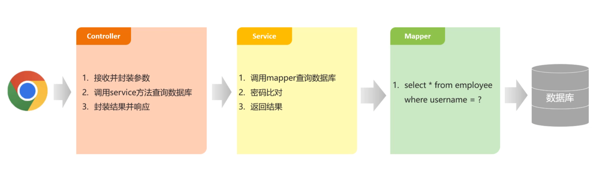

# Springboot开发框架

## 一、三层架构
### 1.三层架构：

1.Controller层：控制层，接受前端发送的请求，对请求进行处理，并响应数据；

2.Service层：业务逻辑层，处理具体的业务逻辑；

3.dao层（或者mapper层（MyBatis中））:数据访问层，负责数据访问操作，包括数据增删改查。



### 2.**为什么要对代码进行拆分？**

**遵循单一职责的原则，便于复用以及后期维护**

### 3.Lombok注解

在Java实体类当中可使用以下三个注解简化操作

* @Data:该注解可以省略私有化成员变量的getter和setter方法，简化代码

* @NoArgsConstructor：该注解可以省略无参构造

* @AllArgsConstructor：该注解可以省略全参构造

### 4.两个Controller层当中的注解


```java
@RestController//表示当前类是一个请求处理类
public class HelloController {

    @RequestMapping("/hello")
    public String hello(String name){
        System.out.println("name :"+name);
        return "Hello "+name+ "~";
    }

}
```

* **@RestController**:表示当前类是一个请求处理类（**@Controller + @ResponseBody** 的组合注解；如果只用`@Controller`，返回字符串会被当成页面路径跳转，用`@RestController`才会把返回值直接作为JSON/文本写回前端）

* **@RequestMapping**("/请求地址"):用来表明该Controller层的请求地址（**支持所有请求方式**：GET/POST/PUT/DELETE等）
* **@RequestBody**：JSON格式的请求数据封装到实体类中需要用该注解

### 5.面试必考：Controller层常用注解速记

| 注解 | 作用 | 面试考点 |
|---|---|---|
| **@GetMapping** | 等价于 `@RequestMapping(method = RequestMethod.GET)` | 专门处理GET请求 |
| **@PostMapping** | 等价于 `@RequestMapping(method = RequestMethod.POST)` | 专门处理POST请求 |
| **@PutMapping** | 等价于 `@RequestMapping(method = RequestMethod.PUT)` | 专门处理PUT请求 |
| **@DeleteMapping** | 等价于 `@RequestMapping(method = RequestMethod.DELETE)` | 专门处理DELETE请求 |
| **@RequestParam** | 接收URL中的`?name=xxx`参数 | 可设置 `required = false` 和 `defaultValue` |
| **@PathVariable** | 接收URL路径中的参数，如 `/user/{id}` | 用于RESTful风格接口 |

**记忆口诀**：`@RestController`返回数据，`@Controller`跳转页面；`@GetMapping`查、`@PostMapping`增、`@PutMapping`改、`@DeleteMapping`删。

---

## 二、分层解耦
三层架构通过处理前端响应数据、处理业务逻辑、访问数据增删改查来实现需求，他们之间通过接口进行耦合，例如：
```java
private UserDao userDao = new UserDaoImpl();
//后续代码直接调用UserDao类当中的方法和return值
```

### 1.IOC和DI

**然而在实际项目开发中，常常遵循“高内聚、低耦合”的软件设计原则**，
我们常常省略此种面向接口编程的耦合方法，转而用IOC和DI原理，将项目当中的类交给他们来进行耦合处理

IOC：**控制反转**，对象的创建控制权由程序自身转移到外部（容器），这种思想称为控制反转；

DI：**依赖注入**容器为应用程序提供运行时所依赖的资源，称之为依赖注入；

Bean对象：IOC当中创建管理的对象，称之为Bean。

### 2.分层解耦的思路

1.将项目中需要耦合的类交给IOC容器管理（IOC，控制反转）；

2.应用程序运行时需要什么对象，直接依赖容器为其提供（DI，依赖注入）。

依照实际情况，Dao和Service层的实现类需要交给IOC容器管理，为Controller和Service注入运行时所依赖的对象。

### 3.SpringBoot启动核心注解（面试常问）

**主启动类上的 `@SpringBootApplication` 其实是一个组合注解，拆分为三个：**

* **@Configuration**：标识当前类是一个配置类
* **@EnableAutoConfiguration**：开启自动配置（SpringBoot自动帮你配好数据源、Tomcat等，核心中的核心）
* **@ComponentScan**：开启组件扫描，默认扫描当前类所在包及其子包

**一句话记住自动配置原理**：启动类上加`@SpringBootApplication` → Spring自动扫包 → 把带有`@Component`及衍生注解的类放进IOC容器 → 根据classpath里的jar包自动做配置。

---

## 三、IOC和DI常用注解

### 常用注解

1.@Component（IOC）：将该实现类交给IOC容器管理

2.@Autowired（DI）：自动在容器当中寻找对象，提供运行时所依赖的对象

**IOC衍生注解：**

@Controller：标注在控制层类上

@Service：标注在业务层类上

@Repository：标注在数据访问层类上（由于与MyBatis整合，用的少）

### 补充：其他IOC/DI高频注解（面试常问）

| 注解 | 作用 |
|---|---|
| **@Configuration** | 标识配置类，通常配合`@Bean`使用 |
| **@Bean** | 用在方法上，将方法的返回值对象交给IOC容器管理（用于第三方库类） |
| **@Scope** | 指定Bean的作用域，默认**singleton**（单例）；常用还有 **prototype**（多例，每次获取都新建） |
| **@Primary** | 多个同类型Bean时，提高该Bean的优先级 |
| **@Qualifier("name")** | 与`@Autowired`配合使用，按**名称**指定注入哪一个Bean |
| **@Resource(name="name")** | JDK提供的注解，默认**按名称**注入，找不到再按类型（与`@Autowired`区别面试常问） |

**Bean作用域速记**：
- **singleton**：单例（默认），整个Spring容器里只有一个实例
- **prototype**：多例，每次获取都创建新对象
- **request/session/application**：Web环境下，分别对应一次请求、一次会话、ServletContext生命周期

### AOP面向切面编程详解（面试高频）

**一句话定义**：AOP（面向切面编程）用于将日志、事务、权限等重复代码抽取出来，在不修改原有代码的情况下对方法进行增强。

**核心概念速记：**

* **Aspect（切面）**：在哪干 + 干什么（封装了通知和切入点的类）
* **JoinPoint（连接点）**：程序执行过程中的任意位置，Spring中通常指方法
* **Pointcut（切入点）**：匹配连接点的表达式，指定对哪些方法做增强
* **Advice（通知）**：具体的增强动作
* **Target（目标对象）**：被代理/被增强的原始对象

**AOP常用注解：**

| 注解 | 作用 |
|---|---|
| **@Aspect** | 声明这是一个切面类 |
| **@Before** | 前置通知，目标方法执行前运行 |
| **@After** | 后置通知，目标方法执行后运行（无论是否异常都会执行） |
| **@AfterReturning** | 返回后通知，目标方法正常返回后运行 |
| **@AfterThrowing** | 异常通知，目标方法抛出异常后运行 |
| **@Around** | 环绕通知，包裹目标方法，性能统计最常用 |

**Advice（通知）类型速记：**

* **@Before**：方法执行前（如权限校验）
* **@After**：方法执行后（如资源释放）
* **@AfterReturning**：方法成功返回后（如记录正常日志）
* **@AfterThrowing**：方法抛异常后（如记录异常日志）
* **@Around**：环绕，方法前后都能干（如计算执行时间）

**AOP实战：自动填充createTime/updateTime/createUser/updateUser**

```java
//步骤一：自定义注解，标记需要自动填充的方法
@Target(ElementType.METHOD)
@Retention(RetentionPolicy.RUNTIME)
public @interface AutoFill {
    //数据库操作类型：INSERT 或 UPDATE
    OperationType value();
}

//步骤二：定义操作类型枚举
public enum OperationType {
    INSERT,
    UPDATE
}

//步骤三：实体类基类，抽取公共字段（实际开发中实体类继承它）
@Data
public class BaseEntity {
    private LocalDateTime createTime;
    private LocalDateTime updateTime;
    private Long createUser;
    private Long updateUser;
}

//步骤四：AOP切面类，实现自动填充
@Aspect
@Component
public class AutoFillAspect {

    //切入点：拦截所有带有@AutoFill注解的方法
    @Pointcut("@annotation(com.example.annotation.AutoFill)")
    public void autoFillPointCut(){}

    //环绕通知：在方法执行前自动填充字段
    @Around("autoFillPointCut()")
    public Object autoFill(ProceedingJoinPoint joinPoint) throws Throwable {
        //1.获取方法签名和注解，判断是INSERT还是UPDATE
        MethodSignature signature = (MethodSignature) joinPoint.getSignature();
        AutoFill autoFill = signature.getMethod().getAnnotation(AutoFill.class);
        OperationType operationType = autoFill.value();

        //2.获取方法参数（实体对象），约定实体放在第一个参数
        Object[] args = joinPoint.getArgs();
        if(args == null || args.length == 0){
            return joinPoint.proceed();
        }
        Object entity = args[0];

        //3.准备赋值的数据
        LocalDateTime now = LocalDateTime.now();
        Long currentId = BaseContext.getCurrentId(); //从ThreadLocal获取当前登录用户ID

        //4.通过反射给实体对象赋值
        if(operationType == OperationType.INSERT){
            //插入操作：填充4个字段（createTime、updateTime、createUser、updateUser）
            Method setCreateTime = entity.getClass().getDeclaredMethod("setCreateTime", LocalDateTime.class);
            Method setUpdateTime = entity.getClass().getDeclaredMethod("setUpdateTime", LocalDateTime.class);
            Method setCreateUser = entity.getClass().getDeclaredMethod("setCreateUser", Long.class);
            Method setUpdateUser = entity.getClass().getDeclaredMethod("setUpdateUser", Long.class);

            setCreateTime.invoke(entity, now);
            setUpdateTime.invoke(entity, now);
            setCreateUser.invoke(entity, currentId);
            setUpdateUser.invoke(entity, currentId);
        } else if(operationType == OperationType.UPDATE){
            //更新操作：只填充2个字段（updateTime、updateUser）
            Method setUpdateTime = entity.getClass().getDeclaredMethod("setUpdateTime", LocalDateTime.class);
            Method setUpdateUser = entity.getClass().getDeclaredMethod("setUpdateUser", Long.class);

            setUpdateTime.invoke(entity, now);
            setUpdateUser.invoke(entity, currentId);
        }

        //5.放行，执行原方法（此时实体对象已经被填充好字段）
        return joinPoint.proceed();
    }
}

//步骤五：使用示例（在Service层方法上加注解即可）
@Service
public class UserServiceImpl implements UserService {

    @AutoFill(OperationType.INSERT) //新增时自动填充4个字段
    public void save(User user){
        userMapper.insert(user);
    }

    @AutoFill(OperationType.UPDATE) //修改时自动填充2个字段
    public void update(User user){
        userMapper.update(user);
    }
}
```

**记忆口诀**：切面里面定义切入点，切入点匹配连接点，连接点触发通知。

---

## 四、功能实现详解

**DI基于@Autowired进行依赖注入的三种常见方式**

①属性注入(常用)

```java
//方式一：属性注入
    @Autowired
    private UserService userService;
```

优点：代码简洁，方便快速开发

缺点：隐藏了类之间的依赖关系，可能会破坏类的封装性

②构造函数注入（官方推荐）

```java
//方式二：构造器注入 ->如果当前类中只存在一个构造函数，@Autowired可以省略
    private final UserService userService;
    @Autowired
    public UserController(UserService userService) {
        this.userService = userService;
    }
```

优点：能清晰地看到类的依赖关系，提高了代码的安全性

缺点：代码繁琐，如果构造参数过多，可能导致构造函数臃肿

**注意：如果只有一个构造函数，@Autowired注解可以省略**

③setter注入

```java
//方式三：setter注入
    private UserService userService;
    @Autowired
    public void setUserService(UserService userService) {
        this.userService = userService;
    }
```

优点：保持了类的封装性，依赖关系更清晰

缺点：需要额外编写setter方法，增加了代码量

### DI详解
* @Autowired注解默认是按照**类型**进行注入的；
* 如果存在多个相同类型的bean，将会出现报错

使用以下三个注解：
* @Primary：提高该bean的优先级
* @Qualifier(name(类名首字母小写))：指定你要注入的是哪一个bean（括号里写名字）
* @Resource(name="（类名首字母小写）")：JDK提供的注解，默认按名称注入

### 面试重点：@Autowired 与 @Resource 的区别（必背）

| 对比项 | @Autowired | @Resource |
|---|---|---|
| **来源** | Spring框架提供 | JDK提供（JSR-250标准） |
| **注入规则** | 默认**按类型（byType）**注入 | 默认**按名称（byName）**注入 |
| **指定名称** | 配合`@Qualifier`使用 | 直接写`name="xxx"` |
| **required属性** | 支持`required = false` | 不支持 |

**记忆口诀**：`Autowired`先找类型，`Resource`先找名字。

---

## 五、最终功能实现：

### 1.Controller层
```java
@Repository
//@Component //要将当前类交给IOC容器管理
public class UserDaoImpl implements UserDao {

    @Override
    public List<String> findAll() {
        //1.加载并读取user.txt来获取用户数据
        InputStream in = this.getClass().getClassLoader().getResourceAsStream("user.txt");
        ArrayList<String> lines = IoUtil.readLines(in, StandardCharsets.UTF_8, new ArrayList<>());
        return lines;
    }
}
```

### 2.Service层实现类（ServiceImpl）
```java
public class UserServiceImpl2 implements UserService {

    @Autowired //应用程序运行时，会自动的查询该类型的bean对象，并且赋值给该成员变量
    //调用DAO对象，获得前端传递的数据
    private UserDao userDao;

    @Override
    public List<User> findAll() {
        //1.调用DAO，获取数据
        List<String> lines = userDao.findAll();

        //2.解析用户信息，封装为User对象->list集合
        List<User> userList = lines.stream().map(line -> {
            //将txt中的每一行数据解析并封装到对象当中
            String[] parts = line.split(",");
            Integer id = Integer.parseInt(parts[0]);
            String username = parts[1];
            String password = parts[2];
            String name = parts[3];
            Integer age = Integer.parseInt(parts[4]);
            LocalDateTime updateTime = LocalDateTime.parse(parts[5], DateTimeFormatter.ofPattern("yyyy-MM-dd HH:mm:ss"));
            return new User(id+200, username, password, name, age, updateTime);
        }).toList();

        return userList;
    }
}
```

### 3.Dao层数据处理层
```java
@Repository
//@Component //要将当前类交给IOC容器管理
public class UserDaoImpl implements UserDao {

    @Override
    public List<String> findAll() {
        //1.加载并读取user.txt来获取用户数据
        InputStream in = this.getClass().getClassLoader().getResourceAsStream("user.txt");
        ArrayList<String> lines = IoUtil.readLines(in, StandardCharsets.UTF_8, new ArrayList<>());
        return lines;
    }
}
```

---

## 六、SpringBoot高频面试知识点补充

### 1.配置文件与配置绑定

SpringBoot默认读取 `application.properties` 或 `application.yml`

**① @Value 注入单个属性**
```java
@Value("${server.port}")
private String serverPort;
```

**② @ConfigurationProperties 批量注入**
将配置文件里一组前缀相同的属性批量绑定到实体类中，需要配合`@Component`使用

### 2.统一异常处理（面试手写代码常考）

```java
@RestControllerAdvice
public class GlobalExceptionHandler {

    @ExceptionHandler(Exception.class)
    public Result handleException(Exception e){
        //记录日志...
        return Result.error("系统异常，请联系管理员");
    }
}
```

* **@RestControllerAdvice**：声明这是一个全局异常处理类（= @ControllerAdvice + @ResponseBody）
* **@ExceptionHandler**：捕获指定类型的异常

### 3.事务管理

在业务层方法上加注解：

```java
@Transactional
public void transfer() {
    //扣钱...
    //加钱...
}
```

**作用**：保证方法内多条数据库操作要么都成功，要么都失败（回滚）

**面试考点**：
- 默认只有运行时异常（RuntimeException）才会回滚
- 要想所有异常都回滚，需要设置 `@Transactional(rollbackFor = Exception.class)`

### 4.AOP 面向切面编程（面试高频概念）

**核心概念速记：**
* **Aspect（切面）**：在哪干 + 干什么（日志、事务、权限）
* **JoinPoint（连接点）**：程序执行过程中的任意位置，通常指方法
* **Pointcut（切入点）**：匹配连接点的表达式，指定对哪些方法增强
* **Advice（通知）**：具体的增强动作（前置、后置、环绕、异常、最终）

**常用注解：**
* **@Aspect**：声明这是一个切面类
* **@Before**：前置通知，方法执行前运行
* **@After**：后置通知，方法执行后运行
* **@Around**：环绕通知，包裹目标方法（性能统计常用）

**记忆口诀**：切面里面定义切入点，切入点匹配连接点，连接点触发通知。

---

## 七、Spring Schedule 定时任务

### 1.@EnableScheduling 注解开启定时任务

在 Spring Boot 主启动类上添加 `@EnableScheduling` 注解，启用定时任务功能：

```java
@SpringBootApplication
@EnableScheduling // 开启定时任务
public class SpringbootApplication {
    public static void main(String[] args) {
        SpringApplication.run(SpringbootApplication.class, args);
    }
}
```

### 2.@Scheduled 注解的使用

在需要定时执行的方法上添加 `@Scheduled` 注解，该方法必须是无返回值、无参数的方法：

```java
@Component
public class ScheduledTask {

    // 方式一：使用 Cron 表达式（最常用）
    @Scheduled(cron = "0 0 2 * * ?") // 每天凌晨2点执行
    public void dailyTask() {
        System.out.println("每日定时任务执行：" + LocalDateTime.now());
    }

    // 方式二：fixedRate（固定速率执行）
    @Scheduled(fixedRate = 5000) // 每隔5秒执行一次
    public void fixedRateTask() {
        System.out.println("固定速率任务：" + LocalDateTime.now());
    }

    // 方式三：fixedDelay（固定延迟执行）
    @Scheduled(fixedDelay = 5000) // 上次执行完成后隔5秒执行
    public void fixedDelayTask() {
        System.out.println("固定延迟任务：" + LocalDateTime.now());
    }

    // 方式四：initialDelay（初始延迟）
    @Scheduled(initialDelay = 3000, fixedDelay = 5000) // 启动后延迟3秒开始，之后每隔5秒执行
    public void initialDelayTask() {
        System.out.println("初始延迟任务：" + LocalDateTime.now());
    }
}
```

### 3.Cron 表达式详解

Cron 表达式是一个字符串，由 6 或 7 个空格分隔的字段组成，格式为：

```
秒 分 时 日 月 周 [年]
```

| 字段 | 允许值 | 允许的特殊字符 |
|---|---|---|
| 秒 | 0-59 | `,` `-` `*` `/` |
| 分 | 0-59 | `,` `-` `*` `/` |
| 时 | 0-23 | `,` `-` `*` `/` |
| 日 | 1-31 | `,` `-` `*` `/` `?` `L` `W` |
| 月 | 1-12 或 JAN-DEC | `,` `-` `*` `/` |
| 周 | 1-7 或 SUN-SAT | `,` `-` `*` `/` `?` `L` `#` |

**特殊字符说明：**

| 字符 | 说明 |
|---|---|
| `*` | 匹配所有值 |
| `?` | 不指定值（用于日和周，避免冲突） |
| `-` | 指定范围 |
| `,` | 指定多个值 |
| `/` | 指定增量（如 `0/5` 表示每5个单位） |
| `L` | 最后（如日字段的 `L` 表示当月最后一天） |
| `W` | 工作日（最近的工作日） |
| `#` | 第几个周几（如 `6#3` 表示第三个周六） |

**常用 Cron 表达式示例：**

```text
0 0 2 * * ?         // 每天凌晨2点执行
0 30 2 * * ?        // 每天凌晨2:30执行
0 0 2 * * MON-FRI   // 周一到周五凌晨2点执行
0 0 2 1 * ?         // 每月1号凌晨2点执行
0 0 2 * * SUN       // 每周日凌晨2点执行
0 0/5 * * * ?       // 每5分钟执行一次
0 0 0 * * ?         // 每天零点执行
```

### 4.fixedRate 与 fixedDelay 的区别（面试常问）

| 对比项 | fixedRate | fixedDelay |
|---|---|---|
| **执行时机** | 以上次**开始时间**为基准计算下次执行时间 | 以上次**结束时间**为基准计算下次执行时间 |
| **执行间隔** | 固定间隔，与任务执行时长无关 | 固定间隔，但受任务执行时长影响 |
| **适用场景** | 任务执行时间短，需要精确控制执行频率 | 任务执行时间长，需要等待上一次完成 |

**示例说明：**
- `fixedRate = 5000`：如果任务执行需要2秒，第1次0秒开始，第2次5秒开始，第3次10秒开始
- `fixedDelay = 5000`：如果任务执行需要2秒，第1次0秒开始，第2次7秒开始（0+2+5），第3次14秒开始

### 5.定时任务配置（可选）

在 `application.yml` 中可以配置定时任务的线程池：

```yaml
spring:
  task:
    scheduling:
      pool:
        size: 10  # 定时任务线程池大小，默认1（单线程）
```

**注意**：默认情况下，Spring Schedule 使用单线程执行所有定时任务，如果某个任务执行时间过长，会阻塞其他任务。建议根据实际需求调整线程池大小。

### 6.实际应用场景

| 场景 | 说明 |
|---|---|
| **数据统计** | 每天凌晨统计前一天的业务数据 |
| **数据同步** | 定期从外部系统同步数据 |
| **缓存刷新** | 定期刷新 Redis 缓存 |
| **日志清理** | 定期清理过期日志文件 |
| **订单处理** | 定期处理超时未支付的订单 |

### 7.面试重点：@Scheduled 注解的注意事项（必背）

1. **方法要求**：被 `@Scheduled` 注解标记的方法必须是**无返回值（void）、无参数**的方法
2. **类要求**：该类必须被 Spring 容器管理（添加 `@Component`、`@Service` 等注解）
3. **线程池**：默认单线程，任务耗时过长会阻塞其他任务，建议配置 `spring.task.scheduling.pool.size`
4. **Cron 表达式**：日和周不能同时指定具体值，必须有一个用 `?`
5. **时区问题**：默认使用服务器时区，可通过 `zone` 属性指定时区（如 `zone = "Asia/Shanghai"`）

**记忆口诀**：定时任务要开启，方法无参无返回；fixedRate看开始，fixedDelay看结束；默认单线程，长任务要注意。
