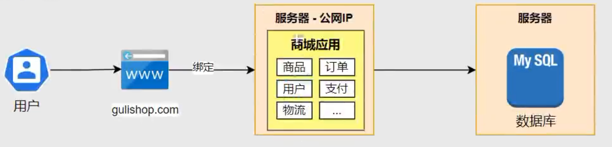
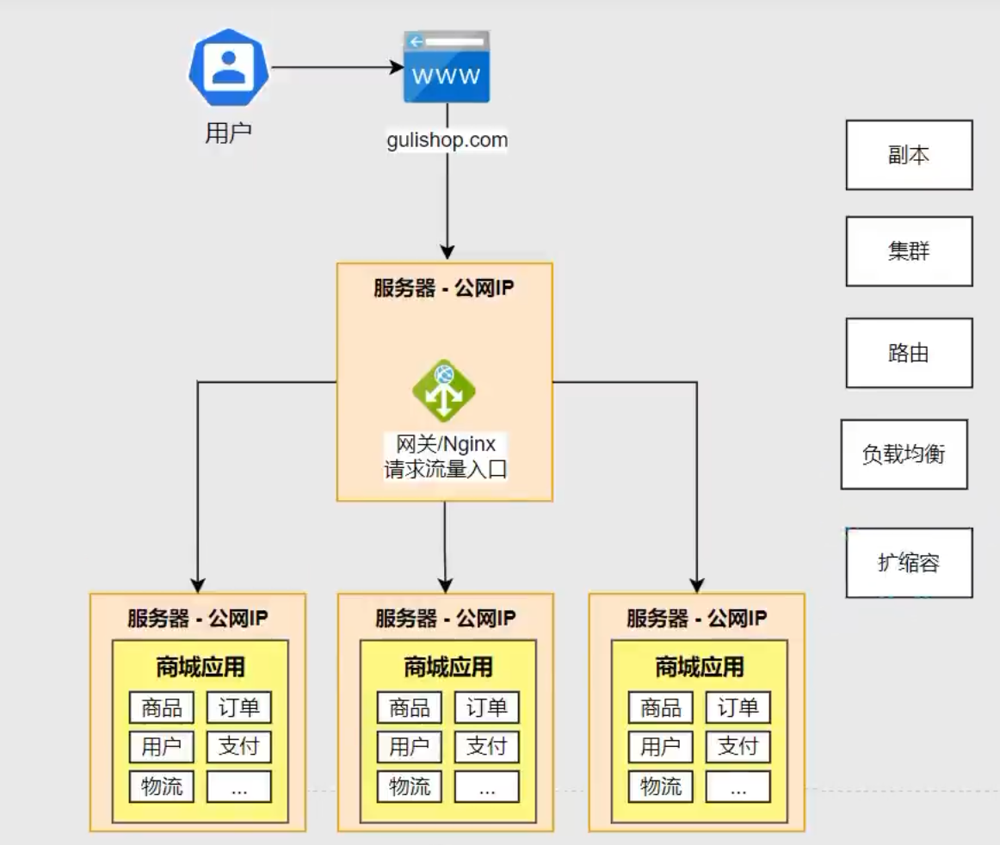
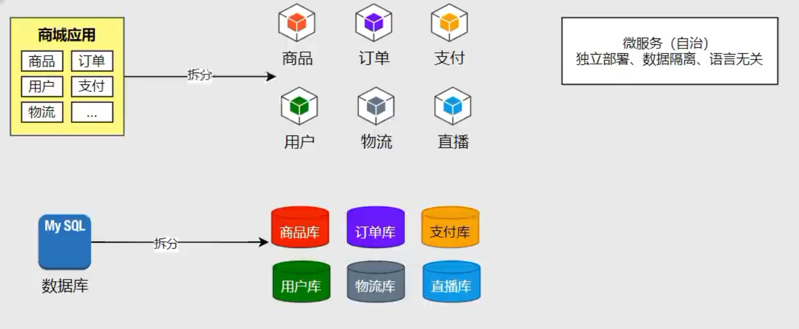
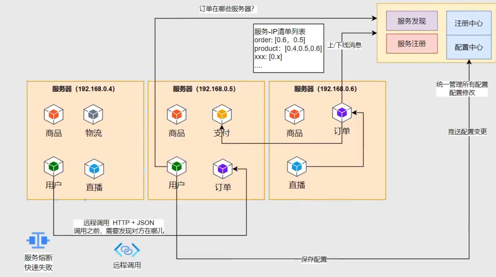
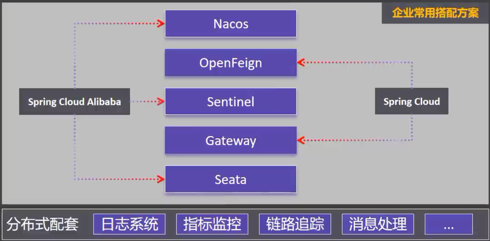

# 📚 SpringCloud微服务架构
## 前言

## 一、分布式基础
### 1.单体架构（ALL IN ONE）
所有功能模块都在一个项目里
- 优点：开发部署简单容易
- 缺点：无法应对高并发

### 2.集群架构
将单体架构创建多个副本，部署在不同的服务器当中，并且将同一个域名指向一个部署公网IP的服务器（网关），网关处理用户请求，并通过负载均衡策略将请求均摊给服务器集群。
- 优点：解决高并发问题
- 缺点1：模块化升级：订单功能经常升级：v1.0、v2.0
- 缺点2：多语言团队：C++直播模块、Java业务模块

### 3.分布式架构
一个大型应用被拆分成很多小应用分布部署在各个机器中（数据库同样也可以拆分出多个微服务模块，对应微服务与数据库模块相联），拆分的每一个模块就叫做**微服务**，微服务的特点是：**独立部署、数据隔离、语言无关**
- 需要处理的问题：单点故障问题：一个微服务只在一台服务器上部署，该服务器故障整个微服务宕机
- 注册中心：维持多个列表数据，用来保存各个微服务都在哪些服务器当中，注册中心可进行服务发现（该服务在哪些服务器）、服务注册（服务上/下线的消息、心跳机制、负载均衡）
- 配置中心；统一管理所有配置：负责保存配置、配置修改、推送配置变更
- 服务熔断：解决服务雪崩的问题、**快速失败机制**，大部分请求失败需要提前拦截更多请求到达服务器

技术点：
- **微服务**：SpringBoot
- **注册中心/配置中心**：Spring Cloud Alibaba Nacos
- **网关**：Spring Cloud Gateway
- **远程调用**：Spring Cloud OpenFeign
- **服务熔断**：Spring Cloud Alibaba Sentinel
- **分布式事务（数据库集群数据一致性）**：Spring Cloud Alibaba Seata
